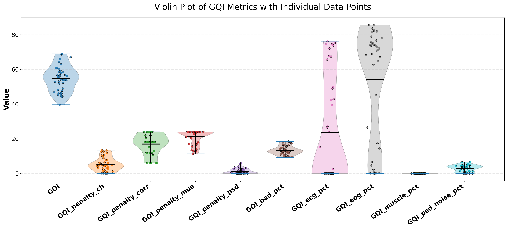
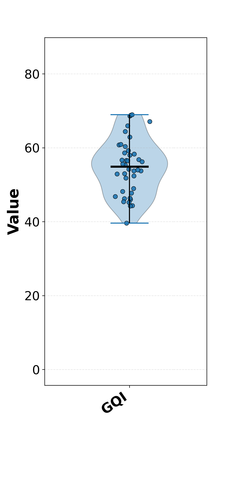
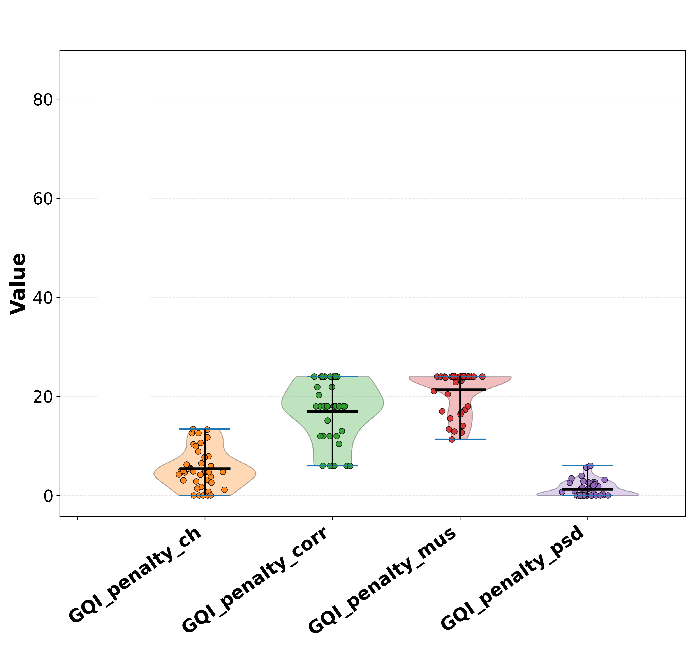

# Global Quality Index (GQI)

MEGqc can compute a `Global Quality Index (GQI)` to provide a single overall estimate of data quality for each subject. The GQI works as a **penalization system:** when one or more metrics detect quality issues, they reduce the subjet'S GQI score accordingly.

The plot above shows how the GQI of a whole dataset is computed.

1. **GQI:** Each dot represents a subject's GQI, and the violin plot summarizes the distribution of GQI scores across the dataset. The dataset GQI is the average of all subjects' GQI scores.

2. **Penalties:** The GQI is reduced based on four penalties, each penalty represents a source of noise (channel quality, physiological correlation, muslce artifacts and power spectral density). Every of these violin plots represent the amount of the penalty.
   

3. **Percentage variables:** The last 5 plots shows specific metrics outcomes. They are the real amount of noise in the dataset and they determine the amount of the penalty.

The penalty system is defined by a system of `weights` and `thresholds`. The weight is the maximun possible penalty, and represents its relative importance for the GQI. There are two thresholds, the `start` and the `end`. If a metric exceeds the predefined **minimun** threshold (the start threshold) , a _portion_ of its weight is substracted from the GQI. If the metric exceeds a predefined **maximun** threshold (the end threshold), the total weight will be penalized. So the more severe the issue, the larger the penalty. 
The amount of the penalty (`weight`) and the thresholds are customizable, but there are defaults values calculated from datasets.

1. **Channel Quality Metrics (Orange plot)**

[Standard Deviation (STD)](../report/std.md) and [Peak-to-Peak (PtP)](../report/ptp.md) metrics are used to asses the signal quality of individual channels. They are calculated separatedly for Magnetometers and Gradiometers, resulting in 4 "sub-metrics" in total.
By default, a penalization to the GQI is applied only if more than 10 channels shows over 30% distortion in one of these 4 sub-metrics (for example, STD in Magnetometers). Each of these 4 sub-metrics contributes equally to the total penalty. The total weight (maximun penalty) for the total channel quality metrics is by default 32%, so the maximun these sub-metrics contribute to the final penalty is 8%. 

| sensor | STD | PtP |
| --- | --- | --- |
| Magnetometers | 8% | 8% |
| Gradiometers | 8% | 8% |

2. **Physiological Artifact Correlation**

[Electrocardiogram (ECG)](../report/ecg.md) and [Electrooculography (EOG)](../report/eog.md) detect how noise correlates with physiological signals. 
By default, their independant weight is 12% and their thresholds are 5% and 25% of distortion. So if both metrics are above 25% distortion, they will remove 24% out of the GQI. 
If these metrics can't be calculate because the dataset lacks of theses channels or they are too noisy to calculate the correlation, there will be a 6% penalization for each.

3. **Muscle Artifacts**

(../report/muscle.md)

4. **Frequency Domain Assessment**

(../report/psd.md)

## Next section
In the next section, we'll walk through the content of the HTML reports.
For a deeper understanding of MEGqc's core functionality, dependencies and derivatives, [visit the pipeline basics page](../extra/details.md).

