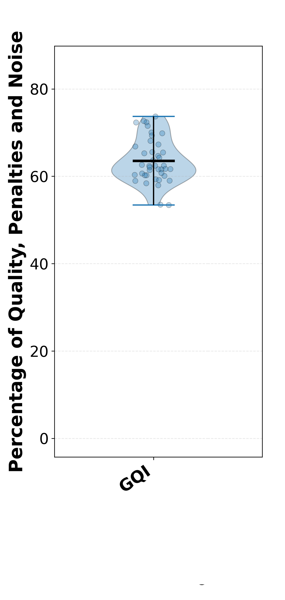

# Global Quality Index (GQI)

MEGqc computes a single overall estimate of data quality for each subject. The GQI works as a **penalization system:** 


```{admonition} Explanation of the penalization system
:class: tip

The penalization system is defined by a system of `weights` and `thresholds`. The weight is the maximun possible penalty, and represents its relative importance for the GQI. There are two thresholds, the `start` and the `end`:
- If a metric exceeds the `start` (predefined **minimun** threshold), a **portion** of its weight is substracted from the GQI.
- If the metric exceeds the `end` (predefined **maximun** threshold), the **total** weight will be penalized.

The weight and both thresholds are customizable, but there are defaults values calculated from datasets.
```

1. **Percentage variables:** The last 6 x-axis items (one item per metric) show the raw percentage of channels affected by the different sources of noise. If any of these value surpass their predefined `thresholds`, the calculation of the penalization starts.


2. **Penalties:** Each x-axis item in the following plot represents the computed penalty which will be substracted from the GQI (starts at 100%). Each x-axis represents one of the four sources of noise *(channel variability, correlational noise from cardiac rythm and eye-blinks, muscle artifacts and power spectral density)*. The penalty is calculated as the percentage of the raw noise normalized (based on the thresholds) and multiply by the weight.


```{dropdown} Example: Channel variability calculation

Channel variability penalization is calculated by the Standard Deviation (STD) and Peak-to-Peak (PtP) metrics. These 2 metrics are calculated separatedly for Magnetometers and Gradiometers, resulting in 4 "submetrics" in total. The final percentage of bad channels is calculate as an average of these 4 submetrics (each submetric contributes equally).

By default, a penalization to the GQI is applied if certain amount of channels shows over 30% distortion in one of these 4 sub-metrics (for example, STD in Magnetometers). The total weight (maximun penalty) for the total channel quality metrics is by default `32%`, so the maximun every submetrics contributes to the final penalty is `8%`. 

| sensor | STD | PtP |
| --- | --- | --- |
| Magnetometers | 8% | 8% |
| Gradiometers | 8% | 8% |

``` 


3. **GQI:** Each dot represents a subject's GQI, and the violin plot summarizes the distribution of GQI scores across the dataset.


```{warning}

If the metrics of the Electrocardiogram (ECG) and Electrooculography (EOG) can't be calculated because the dataset lacks of these channels, or they are too noisy to calculate the correlation, half of the weight of the Physiological Artifact Correlation (`24%` by default) will be penalize from the GQI.

```

## Next section
In the next section, we'll walk through the installation process both for Linux and Windows.


