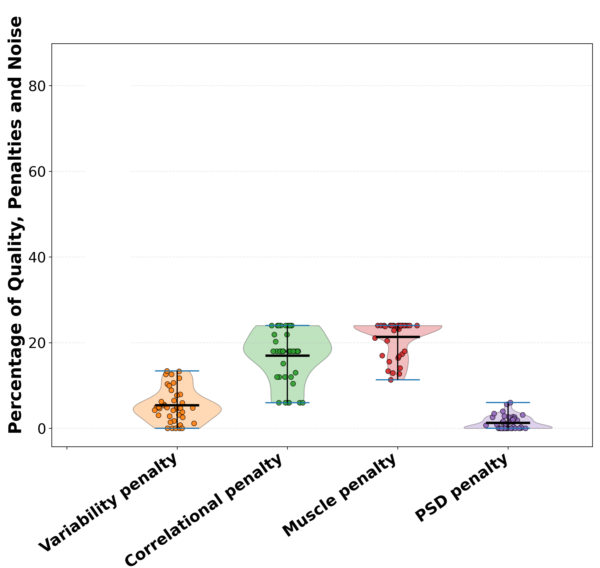

# Global Quality Index (GQI)

MEGqc can compute a `Global Quality Index (GQI)` to provide a single overall estimate of data quality for each subject. The GQI works as a **penalization system:** when one or more metrics detect quality issues, they reduce the subjet'S GQI score accordingly.

The plot above illustrates how the GQI of a whole dataset is computed:

1. **GQI:** Each dot represents a subject's GQI, and the violin plot summarizes the distribution of GQI scores across the dataset. The overall GQI for the dataset is the average of all subjects' scores.

2. **Penalties:** The GQI is reduced based on four sources of noise (channel quality, physiological correlation, muslce artifacts and power spectral density). Each plot represents a potential penalty, substracted from the GQI (starts at 100%). 

3. **Percentage variables:** The last 5 plots shows specific metrics outcomes and they determine the amount of the penalty. The more severe the noise, the larger the penalty.

The penalty system is defined by a system of `weights` and `thresholds`. The weight is the maximun possible penalty, and represents its relative importance for the GQI. There are two thresholds, the `start` and the `end`. If a metric exceeds the predefined **minimun** threshold (the start threshold) , a _portion_ of its weight is substracted from the GQI. If the metric exceeds a predefined **maximun** threshold (the end threshold), the total weight will be penalized.
The weight and the thresholds are customizable, but there are defaults values calculated from datasets.

## Penalty categories

1. **Channel Quality Penalty**

[Standard Deviation (STD)](../report/std.md) and [Peak-to-Peak (PtP)](../report/ptp.md) metrics are used to asses bad channels. These 2 metrics are calculated separatedly for Magnetometers and Gradiometers, resulting in 4 "submetrics" in total. The final percentage of bad channels is calculate as an average of these 4 submetrics (each submetric contributes equally).
By default, a penalization to the GQI is applied only if more than `10` channels shows over 30% distortion in one of these 4 sub-metrics (for example, STD in Magnetometers). The total weight (maximun penalty) for the total channel quality metrics is by default `32%`, so the maximun every submetrics contributes to the final penalty is `8%`. 

| sensor | STD | PtP |
| --- | --- | --- |
| Magnetometers | 8% | 8% |
| Gradiometers | 8% | 8% |

2. **Physiological Artifact Penalty**

The weight (`24%` by default) of the penalty is divided equally between [Electrocardiogram (ECG)](../report/ecg.md) and [Electrooculography (EOG)](../report/eog.md) percentage of signal correlated with physiological signals. 

If these metrics can't be calculate because the dataset lacks of theses channels or they are too noisy to calculate the correlation, there will be a 6% penalization for each.

3. **Muscle Artifacts**

(../report/muscle.md)

4. **Frequency Domain Assessment**

(../report/psd.md)

## Next section
In the next section, we'll walk through the content of the HTML reports.
For a deeper understanding of MEGqc's core functionality, dependencies and derivatives, [visit the pipeline basics page](../extra/details.md).

