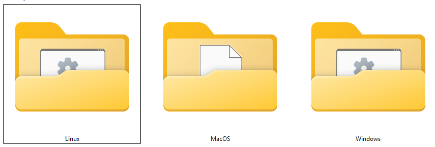
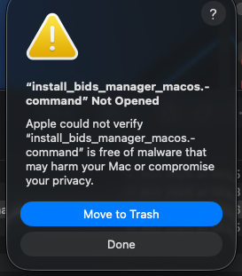
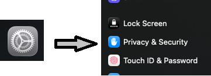
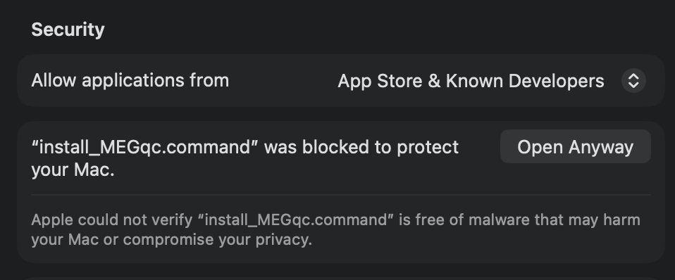

# Installation Guide
Now that we have a general understanding of MEGqc and its Metrics reports, this section will guide you through the installation of MEGqc. 


## Installers

* **Download the ZIP package:** **[📦 Installers](https://github.com/ANCPLabOldenburg/MEGqc/raw/main/installers/installers.zip)**

* **Extract the ZIP file and run the script:** After extracting the ZIP, you will see one subfolder per operating system. Each subfolder contains a specific installation script: 
<br>


| OS               | Script                        | How to Run                         |
|------------------|-------------------------------|------------------------------------|
| **Windows 10/11**| `install_MEGqc.bat`     | Double-click and `Run` in the Security Warning         |
| **Linux**        | `install_MEGqc.sh`      | Allow execution (see below) and run the installer |
| **MacOS**        | `install_MEGqc.command`      | Allow execution (see below) and run the installer |



<br>


## Allow script execution and run the installer for Linux and MacOS users

### **Linux systems:**

If you're working in Linux, you'll need first to allow the `.sh` script execution. This can be done in two different ways:

````{tab-set}
```{tab-item} Linux
Right click and select **"Open terminal here"** or open a terminal and use:

    cd /path/to/your/installer

Give execute permissions to the installer

    chmod +x install_bids_manager.sh


Or alternatively

    chmod 755 install_bids_manager.sh

Run the installer

    ./install_bids_manager.sh


```

```{tab-item} XFCE systems

Allow "execute" option in XFCE systems

    xfconf-query --channel thunar --property /misc-exec-shell-scripts-by-default --create --type bool --set true

Give execute permissions to the installer

    chmod +x install_bids_manager.sh

Or alternatively

    chmod 755 install_bids_manager.sh

Run the installer

    ./install_bids_manager.sh

```
````

<br>

### **MacOS systems:**
  
Because the installer is not from the App Store, macOS will initially block it.

* Double-click `install_bids_manager.command` will open a warning ⚠️ dialog. Cick `Done`.



<br>
  
* Open `System Settings` and scroll until `Privacy & Security`.



<br>

* In the `Security` section, you should now see a mesage about the blocked attempt. Click `Open Anyways` to allow it.
  


<br>
