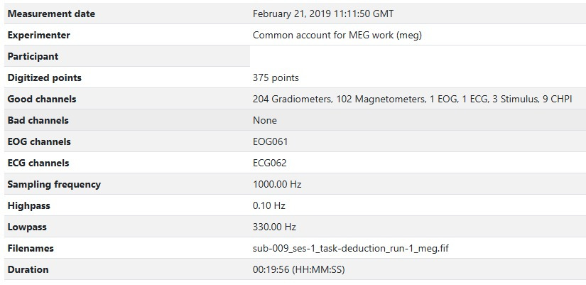

# MEGqc report overview

Every `metric` in MEGqc generates its own HTML report. Each report is full of interactive figures that you can zoom in and out, reveal legends on hovering, hide or show specific epochs or channels... In this tutorial we've included some GIFs to demonstrate the interactive capabilities of the figures.

Almost every report starts with the 2 following sections: 

## Raw Information

This section includes some general metadata (date, experimenter, duration...), some channels' information (more on that later), and basic details about the sampling frequency and applied filters.




## Sensor Positions


Visual representation of the spatial distribution of MEG sensors on the subject's head. The sensors are divided into eight color-coded groups representing different lobes. This same color coding will be used frequently throughout the reports for reference.

1. **Rotate the figure**
By clicking and holding the mouse left-button while dragging, you can rotate the sensor positions figure to view it from different angles.


2. **Hide and reveal sensors**
By clicking on the legend block, you can hide the sensors of a specific lobe. Clicking the block again will make the sensors reappear.


There are 2 different types of meters in MEG sensors: **Magnetometers** and **Gradiometers**. Each sensor might contain one type of meter or both. The sensor labels help you distinguish between them:
- **Magnetometer:** it measures the magnetic field directly, providing data on its strength and direction. It is more sensitive to distant source, making it more vulnerable to external magnetic noise. Its label ends with _"1"_ (e.g., _MEG1011_).
- **Gradiometers:** These sensors come in pairs and they measure the gradient of the magentic field, so the difference between 2 measurements. This setup helps filter out environemntal noise. Their labels end with _"2"_ and _"3"_ indicating the two Gradiometers in a specific sensor (e.g. _MEG0112_ and _MEG0113_).


```{admonition} Sensor labels

The sensor labels appear when you hover over a  sensor dot. Alternatively, you can enable _"Always show channels names"_ option, which keeps all labels visible. Enabling this feature might take some time to render, specially if all lobes are visible.

``` 


## Metrics Overview
In this tutorial we will focus only on the Magnetometers, but the logic and interpretation for Gradiometers are very similar. Click on any of the metrics below to open a their report overview:

1. [Standard Deviation of the Data](../report/std.md)
2. [Power Spectral Density](../report/psd.md)
3. [Peal-to-Peak (manual calculation)](../report/ptp.md)
4. [ECG (Electrocardiogram) calculation](../report/ecg.md)
5. [EOG (Electrooculography) calculation]((../report/eog.md))
6. [Muscle Artifacts calculation](../report/muscle.md)


```{admonition} Figures source

The examples in this section are taken from the report of the subject 009 from the  _ds003483_ dataset available on OpenNeuro. This same dataset was used by Gaponsertva (2023) to evaluate the MEGqc tool. In the Practical Guide you'll learn how to [download this same dataset](extra/openneuro.md), so you can recreate these same reports yourself.

``` 

