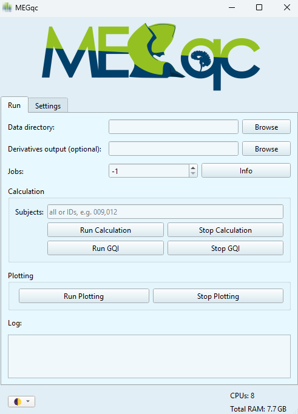

# Practical Guide
Now that we have a general understanding of MEGqc and the Metrics reports, this guide will walk you through how to install, run and use Megqc on your own datasets.

1. [Installation](../new/install.md):
Learn how to download and run the installer.

2. [Running the calculation module](../new/run.md)
Learn how to use the intuitive GUI to run the metrics calculation on your dataset.

3. [Running the plotting module](../new/plot.md)
Learn how to generate the HTML reports.


<br>

<br>

```{admonition} Don't have a Dataset?

In case you don't have a BIDS compliant MEG dataset, here’s how to download one from OpenNeuro:
[How to download a dataset from OpenNeuro](../extra/openneuro.md)

```


