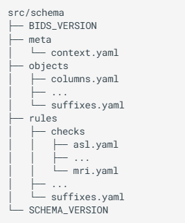

## What is BIDS? 

*"Neuroimaging experiments result in complex data that can be arranged in many different ways, and for a long time, there was no consensus on how to organize and share data obtained in neuroimaging experiments. **Brain Imaging Data Structure (BIDS)**, describes a simple and easy to adopt way of organizing neuroimaging and behavioral data"* (Gorgolewski et al., 2016; Niso et al., 2018). 


The **[BIDS Specification](https://bids-specification.readthedocs.io/en/stable/)** defines the rules for data organizing and naming conventions. It is continuously updated thanks to community efforts. To ensure that the Specifications are implemented consistently, BIDS provides **[BIDS Schema](https://bids-specification.readthedocs.io/en/stable/appendices/schema.html)**, a machine readable representation written in YAML format. The BIDS Schema describes the different possible objects (BIDS concepts), rules (for naming filepaths and contents) and meta (the context to which rules can be applied).




```{admonition} Would you like to know more about the BIDS specification?

You can find more information the BIDS Specification on their [official BIDS webpage](https://bids.neuroimaging.io/).

```


Gapontseva (2023) evaluated the MEGqc software thanks to 21  MEG datasets obtained from the OpenNeuro data library. [OpenNeuro](https://openneuro.org/) is a free and open platform with more than 50 thousand participants and more than one thousand public BIDS compliant MRI, PET, MEG, EEG and iEEG datasets. 


```{admonition} Want to check more extra content?
:class: tip

Head back to the [main extra content page](../book/extra.md) to explore the others!

``` 
