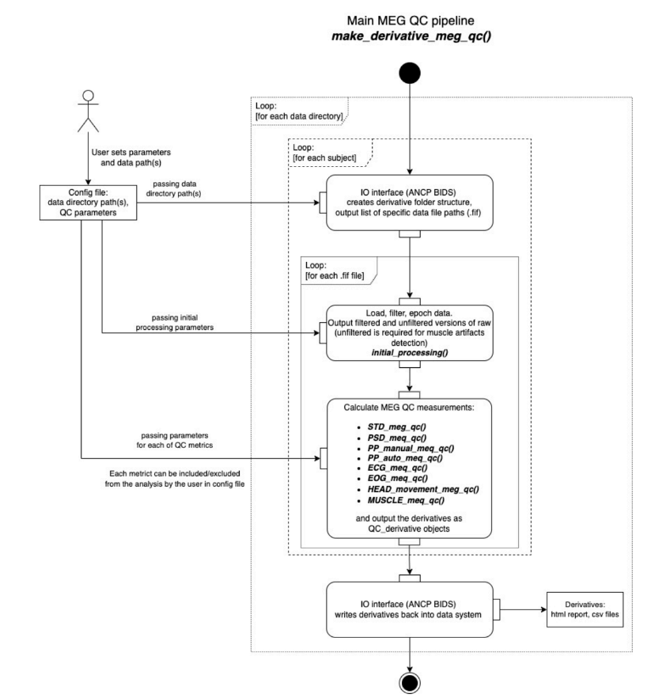

# Pipeline basics

In case you are curious about some functionalities of MEGqc, this section provides with a short overview of some key aspects:

## General Pipeline Structure

The following figure (Gaponsetva, 2023) describes the general process of the pipeline. It might look  a bit overwhelming, but we won't go too much into detail:

The time is on the Y axis, from top to bottom: 

- The **configuration** file contains the data directory path and the parameters for the selected metrics. Default values for all metrics are preset, but they can be modified as needed.
- Data files are identified thanks to ancpBIDS.
- Datasets are loaded and **early processed:** epoching, resampling and filtering (taking into account users' parameters).
- Selected **metrics** are executed (taking into account users' parameters) and results compiled into the **derivatives**.
- ancpBIDS writes the **derivatives** to the dataset directory, maintaining BIDS naming convention.

    

### Dependencies
It's not necessary to manually pip install the different dependencies anymore.
We'll briefly introduce them here the main ones and their functiionality:

- **[mne (Magnetic and Electric Neuroimaging)](https://mne.tools/stable/index.html):** "MNE is an open-source package for exploring, visualizing and analyzing human neuropshysiological data (...). This package is also the basis for the MEGqc pipeline" (Gapontseva, 2023). It has been extensively documented and constantly updated by an active community support. 

- **[ancpBIDS](https://ancpbids.readthedocs.io/en/latest/userDocCombined.html):** This library, developed in the ANCP lab, is used to read and query BIDS datasets as well as write the derivatives back. 

- **[Numpy (Numerical Python)](https://numpy.org/doc/)** and **[pandas](https://pandas.pydata.org/docs/):** Both libraries are necessary for scientific computing and data manipulation in Python, particulary for working with multidimensional arrays and large matrices. 

- **[plotly](https://plotly.com/python-api-reference/)**: This library is used to create the interactive plots and visualize results. Plotly also supports exporting the figures in HTML format.

## What is BIDS?

Neuroimaging experiments result in complex data that can be arranged in many different ways, and for a long time, there was no consensus on how to organize and share data obtained in neuroimaging experiments. **Brain Imaging Data Structure (BIDS)**, describes a simple and easy to adopt way of organizing neuroimaging and behavioral data (Gorgolewski et al., 2016; Niso et al., 2018) facilitating collaboration between researches and saving time and effort.  _(fragment adapted from BIDS official website)._ 

BIDS describes the structure of the data, directories and sub-directories, name-structure, file-naming and file formats. MEGqc uses **ancpBIDS**, a Python library which facilitates working with BIDS, both for identifiying the files and also for writting the results according to BIDS. 

Gapontseva (2023) evaluated the MEGqc software thanks to 21  MEG datasets obtained from the OpenNeuro data library. [OpenNeuro](https://openneuro.org/) is a free and open platform with more than 50 thousand participants and more than one thousand public BIDS compliant MRI, PET, MEG, EEG and iEEG datasets. 

### Derivatives Metadata
BIDS suggest that the Metadata should be stored in .json and .tsv files, because both machine-readable type of file easily accesible by Python, Matlab, Excel or R. MEgqc offers both types of files:

* **JSON files** with the key information for each of the quality metrics. JSON (JavaScript Object Notation) files are lightweight data format that store structured data in a readable, text-based format using key-value pairs, arrays, and nested objects.
* **TSV files** with more detailed results of the metrics. The plotting module of MEGqc will use them to build the visual HTML reports. TSV (Tab-Separated Values) files are simple text files that stores tabular data, with each line representing a row and each value in the row separated by tab characters.
