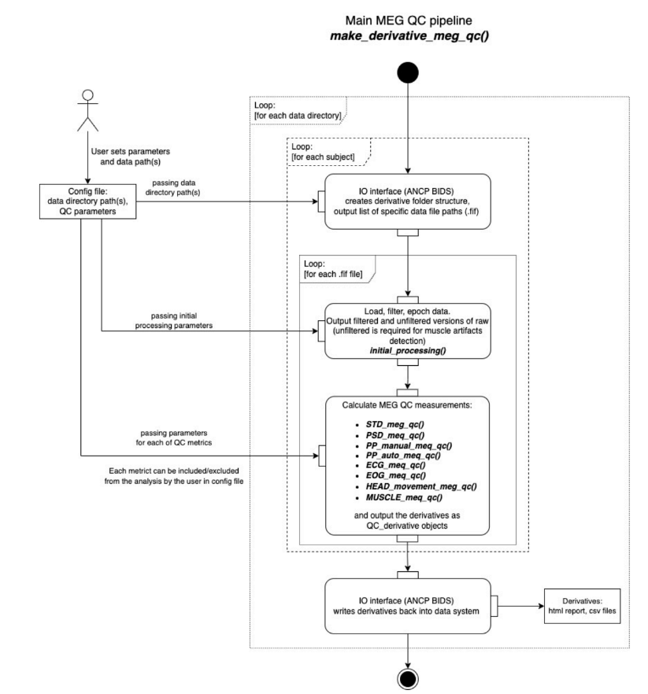

# Pipeline basics

This section summarizes the MEGqc execution model and dependency roles.

## General pipeline structure



At high level:

1. Read runtime configuration (`settings.ini`) and execution flags.
2. Discover BIDS-compatible MEG data with ANCPBIDS.
3. Apply minimal preprocessing (crop/filter/resample/epoching).
4. Compute selected metric modules.
5. Write machine-readable derivatives (`TSV`, `JSON`).
6. Generate report layers from derivatives (subject/group/multisample; QA/QC).

## Report levels

- **QA Subject**: per-subject interactive reports.
- **QA Group**: dataset-level QA aggregation.
- **QA Multisample**: cross-dataset QA comparison.
- **QC Group**: GQI-based QC summary per dataset.
- **QC Multisample**: cross-dataset QC comparison.

## Derivative formats

MEGqc uses machine-readable derivatives aligned with BIDS conventions:

- **JSON**: structured summaries and metadata.
- **TSV**: tabular metric-level details used by plotting and downstream processing.

## Dependencies (what each one is used for)

Core/direct dependencies in current package:

- `ancpbids`: BIDS dataset traversal and derivatives handling.
- `mne`: MEG signal I/O and domain-specific signal processing.
- `pandas`: tabular computations and derivative tables.
- `plotly`: interactive report figures.
- `joblib`: subject-level parallelism.
- `pyqt6`: GUI framework.
- `pyqt6-plugins` (non-macOS): GUI platform plugin support.
- `numba`: acceleration for selected kernels (for example manual PtP paths).
- `psutil`: runtime system information in GUI (CPU/RAM awareness).
- `matplotlib`: auxiliary plotting utilities in selected report modules.
- `prompt_toolkit`: terminal UX utilities used by command-line workflows.

Additional libraries may appear as transitive dependencies via core packages.

```{admonition} Want to check more extra content?
:class: tip

Head back to the [main extra content page](../book/extra.md) to explore the others.

```
