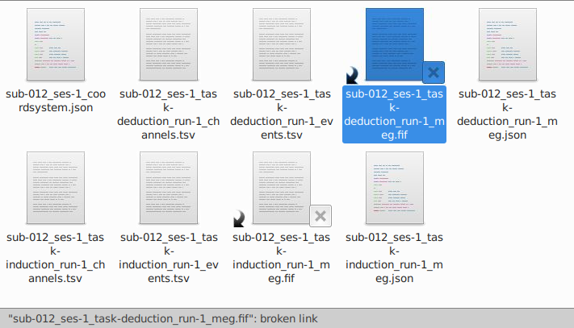

# How to download a dataset from OpenNeuro

[OpenNeuro](https://openneuro.org/) is a free and open platform hosting over 1000 public, BIDS compliant datasets, including MRI, PET, MEG, EEG and iEEG datasets. Gapontseva (2023) evaluated the MEGqc software thanks to 21 MEG datasets obtained from the OpenNeuro data library. This section explains how to download one subject of one dataset from OpenNeuro: 

1. **Find the dataset:** navigate to the [OpenNeuro homepage](https://openneuro.org/) (or follow the hyperlink) and search for the dataset using the Accession Number: `ds003483`.
2. **Download options:** When you click `"Download"` you'll be presented with several options:
    * Download with your browser
    * Download from S3
    * Download with Node.js
    * Download with DataLad
    * Download with a shell script. 
    
Given the dataset's size (21 participants, 24.48 GB), dowloading the full dataset may be unnecessary. To save time and storage, we'll dowload only one subject's folder using **Datalad**.


```{warning} Windows Limitation
:class: dropdown

Sadly, both [Datalad](https://handbook.datalad.org/en/latest/intro/windows.html) and [git-annex](https://git-annex.branchable.com/install/Windows/) behave differently on Windows and come with known limitations. We are currently exploring different ways to approach this issue, but if possible, we recommen using Linux for working with Datalad and git-annex workflows.

```

## Getting started with DataLad
[DataLad](github.com/datalad) is a free and open source data tool for management of large datasets. It can be used to download a single subject folder from a dataset. Be sure to have your [environment](./environment.md) ready.

0. **Ensure `git-annex` is properly installed on your environment:** DataLad requires `git-annex` version 8.20200309 (or higher). Verify your installation and, if needed, update `git-annex`.
   
```bash
git annex version
```
<br>

1. **Install datalad within your environment:** 

```bash
pip install datalad
```

<br>

2. **Clone the dataset repository:** It copies the entire dataset's structure, but only lightweight metada (such as .json), the actual data files (.fif in this case) are not downloaded, even thought they _"broken links"_ placeholders will be created. Be sure you are working in your desired directory (with `cd`), then run:
```bash
datalad install https://github.com/OpenNeuroDatasets/ds003483.git
```

<br>




3. **Download only the sub-009 folder:** First change directory within the dataset:
   
```bash
cd ds003483/
```

Then use the `get` command to download only the data for subject 009.

```bash
datalad get sub-009/
```

<br>


```{admonition} Want to check more extra content?
:class: tip

Head back to the [main extra content page](../book/extra.md) to explore the others!

``` 

