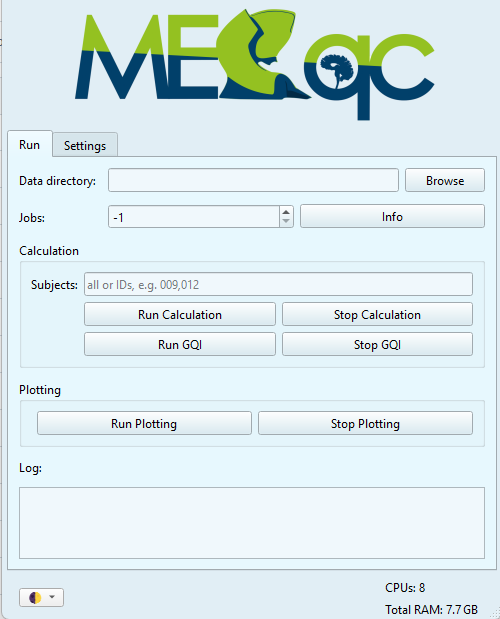

# Mini-MEGqc Interface

Thanks to the graphical user interface (GUI) you will be able to generate MEGqc reports without using the terminal. You can open the GUI by clicking the MEGqc shortcut on your Desktop. 

