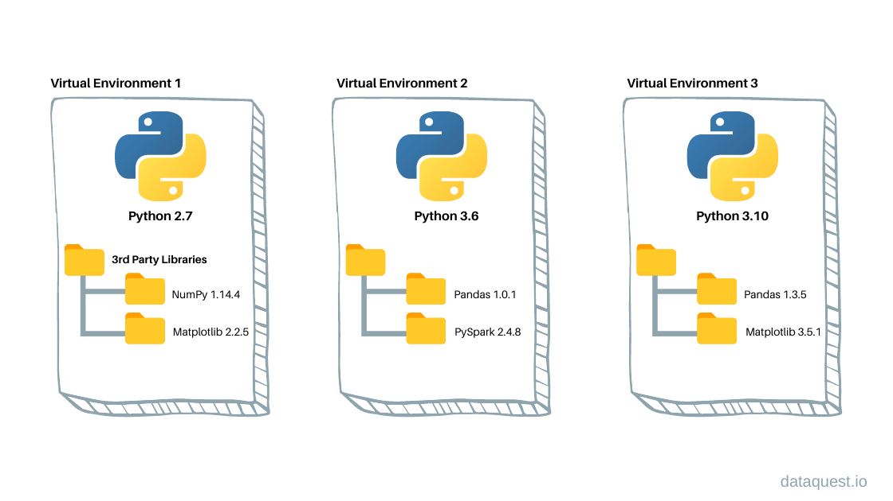

# CLI Installation Guide

Now we'll start with the installation process for the command-line interface (CLI) MEGqc. 

<br>

Before diving in, we strongly recommend using MEGqc within a **virtual environment** to avoid conflicts with system dependencies.
The GUI installer  automatically creates and manages a virtual environment. Meanwhile the CLI setup requires you to create one manually.

## Virtual environments
Virtual environments create isolated and self-contained workspaces, allowing us to manage project-specific dependencies separatedly from system-wide installation. This isollation has several benefits:
- **Avoid dependency conflicts:** prevents interferences between project-specific and system-wide dependenciesm, such as common erors related to version mismatches.
- **Transparency and Open Science:** Ensures that others can replicate your results and reproduce your analysis reliably.



To create and activate your virtual environment, follow these steps:
1. Navigate to the directory where you want to create the environment using the `cd` command in the terminal.
2. Create the virtual environment:

```bash
python3 -m venv <your_environment_name>
```

3. Activate the virtual environment:

```bash
source /path/to/environment/bin/activate
```
 

## Install the MEGqc Package
Once your environment is activated, you can install Python packages with `pip`, and these installations will only apply to your virtual environment. To install MEGqc core functionality, run the following command in the terminal:

```bash
pip install git+https://github.com/ANCPLabOldenburg/MEGqc.git
```


<!--
Next, you will need to clone the [Github Repository](https://github.com/ANCPLabOldenburg/MEGqc). 


- The folder _docker_ contains the starting script *run_megqc.py*.
- The folder *meg_qc* is a copy of the previously installed MEGqc package via `pip`.

-->

## Install depencies?
Thanks to the last update, it's not necessary to manually pip install the different dependencies anymore. All of them are installed automatically along with the MEGqc package.
If you want to know more about them and their functionalitiy, please [visit the pipeline basics page](../extra/details.md).


<!--
Still, if your python version is older than 3.9, it might be necessary to upgrade pandas to 2.2.3 version:

        pip install --upgrade pandas
-->


## Next section
In the next section we'll get to the tutorial, where you can access the isntructions to run the calculation and the plotting module, both for GUI MEGqc and CLI MEGqc.
