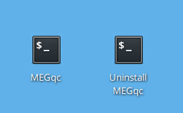

# Installer-based Installation Guide

This pathway is intended for users who want a packaged installation with minimal manual setup.

## 1. Download installer bundle

Download and extract:

- [Installer ZIP](https://github.com/ANCPLabOldenburg/MEGqc/raw/main/installers/installers.zip)

Included scripts:

| OS | Script | How to run |
|---|---|---|
| Windows 10/11 | `install_MEGqc.bat` | Double-click |
| Linux (x86) | `install_MEGqc.sh` | Make executable, then run |
| macOS (ARM/Apple Silicon) | `install_MEGqc.command` | Allow execution, then run |

```{admonition} What the installer does
:class: dropdown

1. Creates a MEGqc folder in the user home directory.
2. Provisions a compatible Python 3.10 runtime.
3. Creates a virtual environment.
4. Installs MEGqc and dependencies.
5. Creates desktop launch/uninstall shortcuts.

```

## 2. Platform notes

### Linux

```bash
cd /path/to/installer
chmod +x install_MEGqc.sh
./install_MEGqc.sh
```

### macOS

If Gatekeeper blocks the script on first run:

1. Double-click `install_MEGqc.command`.
2. Open **System Settings -> Privacy & Security**.
3. Click **Open Anyway** for the blocked script.

## 3. Launching and uninstalling

Desktop shortcuts are created for launch and uninstall.



## 4. Installation paths

- Windows: `C:\Users\<user>\MEGqc`
- Linux: `/home/<user>/MEGqc`
- macOS: `/Users/<user>/MEGqc`

## 5. Optional manual environment activation

- Windows: `\Users\<user>\MEGqc\env\Scripts\activate`
- Linux: `source /home/<user>/MEGqc/env/bin/activate`
- macOS: `source /Users/<user>/MEGqc/env/bin/activate`

Continue with the [Tutorial](../book/tutorial.md).
