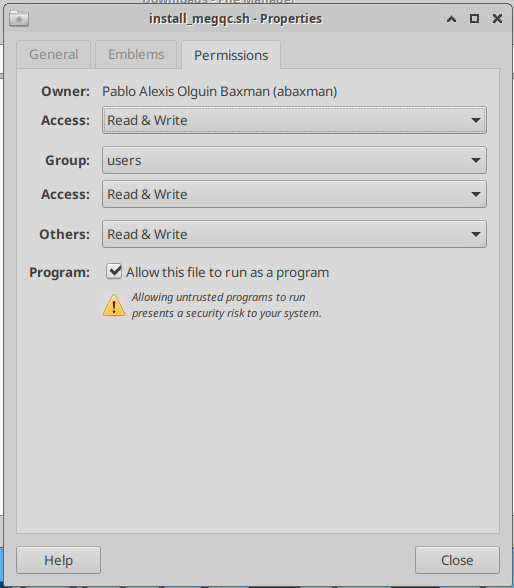

# Easy Installation

We have created a shell script installer that will make the installation process of MEGqc smoother and easier. This installer only works for XFCE-based Linux systems so far, but we're working on a Windows version.

## 1. Download the installer
Download the `.sh` file from the following link:

👉 [MEGqc Installer (Mega.nz)](https://mega.nz/file/dMBh1QBQ#o3m1HGd_F-qZEXNR0s7kXzheUSgC3DXYVzSqhq-ulgY)
  
### 2. Allow script execution
This can be done in two different ways:

````{tab-set}
```{tab-item} Option 1
Right click and select **"Open terminal here"** or open a terminal and use:

    cd /path/to/your/installer

Allow "execute" option in XFCE systems

    xfconf-query --channel thunar --property /misc-exec-shell-scripts-by-default --create --type bool --set true

Give execute permissions to the installer

    chmod +x install_megqc.sh


```

```{tab-item} Option 2

Make the installer executable by right-clicking the file, selecting Properties, navigating to the Permissions tab, and checking the box *"Allow this file to run as a program"*.

    


```
````


   
## 3. **Run the installer**

Now your shell script installer is ready to run! You can either **double-click the** `sh` **file** or **run it from the terminal**:

    ./install_megqc.sh

Once launched, the terminal will prompt you to input a path where MEGqc should be installed. The installer will then create its own **virtual environment** and handle all the **depedencies**. MEGqc is compatible with Python versions 3.8 to 3.12, but if you don't have any valid Python version, the installer will install Python 3.10. 

Now your installation is complete! In your chosen directory, you'll find a folder named `runMEGqc` containing the virtual environment, along with a script called `uninstall_megqc.sh`.

On your **Desktop** you will also see two terminal launchers:
* `MEGqc` — will launch the GUI.
* `Uninstall MEGqc`  — will remove MEGqc from your system, including its environment and related files.

```{admonition} If you want to know...
:class: tip, dropdown

what is an [environment](../extra/environment.md) or what kind of [dependencies](../extra/details.md) does MEGqc have, follow the links.

```
# Next section

In the next section you'll learn how to use the GUI to run MEGqc.

