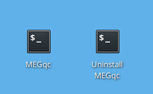
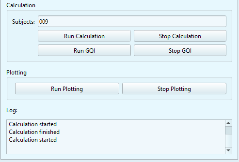
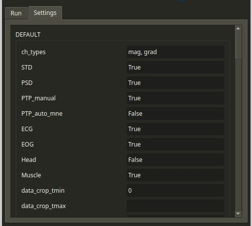
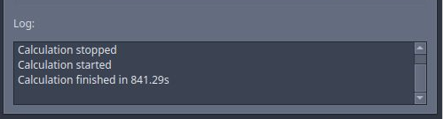

# Run Calculation

Thanks to the graphical user interface (GUI) you will be able to run MEGqc and generate reports without using the terminal. 

## 1. Launching MEGqc
To open the GUI, click the MEGqc shortcut on your Desktop.




*(a terminal will open alongside the GUI, you can safely close the terminal if you want)*


## 2. Set Calculation parameters



<br>

* **Data directory:** you can *paste* the path to your dataset or click `Browse` to select the folder manually.
* **Subjects:** you can write `all` to analyze every subject, or enter a specific ID (e.g., `009` for `sub-009`).
* **Jobs:** Choose how many parallels jobs to use during the processing of your data. The default option is `1`, but you can increase the speed of the processing by increasing the number of parallel Jobs.

```{admonition} How do I know the right amount of parallel Jobs?
:class: tip

  * MEGqc automatically detects and displays the number of cores ('CPUs') and the total available RAM (see the lower-corner of the GUI).
  * The `Info` button will give you personalized recommendations based on system memory.
  * You may also use `-1` to use **all available cores**. 

``` 

## 3. Advance Settings
The `Setting` tab allows you to customize your analysis. These settings are optional, as the default values were calculated by Gaponsetva (2023) to be compatible with a broad variety of datasets.



<br>

* The basic settings allows you to select the channel types (`mag` or `grade` or both), and the specific metric to compute.
* The settings are grouped into categories, such as *filtering, epoching,* and *metric-specific* options.  
* When you hover over them, you'll see a short description along with the default value.
* Once you're done editing your settings, don't forget to click `Save Settings` at the end of the list.

If you want to learn more about the specific settings included in MEGqc, you can find a detailed explanation in the [Setting page](../extra/settings.md) or read a brief overview in the dropdwon below:


```{admonition} Settings overview
:class: dropdown

  * **Default settings:** Select the **channel types** to incldues (`mag` or `grade` or both), which **metrics** to compute (e.g. STD, PSD or PTP), and what plots to generate (such as interactive time series).
 * **Filtering:** configure the **high-pass / low-pass** cut-offs, choose between **IIR or FIR** filters, and apply **downsampling** if needed.
 * **Epoching:** Customize epochs **duration**, define the *stimulus channel* or how to handle duplicate **events**.
 * **Metric-specific settings:** Every metrics include their own editable settings, such as how many standard deviations from the mean to use as a threshold, the edge frequencies for PSD calculation, or the minimun PTP amplitude to count as a peak. 

``` 

## 4. Run Calculation
Once you've set your parameters (Data directory, Subjects and parallel Jobs) click `Run Calculation`. The **Log** window will display the ongoing process, including updates and any errors. You can also find more detailed information in the terminal window.



Once the process is finished, a new folder called `MEG_qc` will be created inside your dataset's `derivatives` folder . This folder will contain one folder per subject containing several machine-readable files (**.tsv** and **.json**) for each metric, run and task. If you're following this tutorial, the path to the MEGqc derivatives would look something like:


   /path/to/your/dataset/ds003483/derivatives/Meg_QC/calculation/sub-009/


Congratulations! You did it!

```{admonition} GUI visual theme
:class: tip

Use the left-corner icon to open a dropdown list with all available themes. This will only affect the display of the GUI. This list also includes themes with high-contrast options. 

```
# Next section
In the next section you'll learn how to use calculation derivatives to create the html reports.


