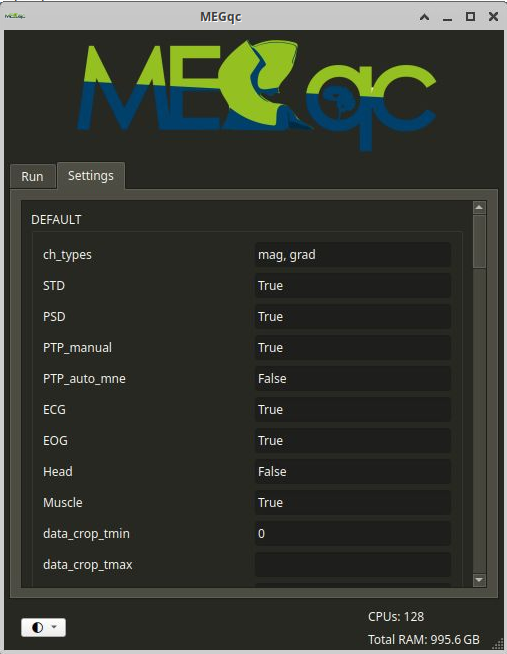

# Run Calculation

Thanks to the graphical user interface (GUI) you will be able to run MEGqc and generate reports without using the terminal. 

## 1. Launching MEGqc
To open the GUI, click the MEGqc shortcut on your Desktop. A terminal will open alongside the GUI, you can safely close the terminal if you want.


## 2. Set Calculation parameters
* **Data directory:** you can *paste* the path to your dataset or click `Browse` to select the folder manually.
* **Subjects:** you can write `all` to analyze every subject, or enter a specific ID (e.g., `009` for `sub-009`).
* **Jobs:** Choose how many parallels jobs to use during the processing of your data. The default option is `1`, but you can increase the speed of the processing by increasing the number of parallel Jobs.

```{admonition} How do I know the right amount of parallel Jobs?
:class: tip

  * MEGqc automatically detects and displays the number of cores ('CPUs') and the total available RAM (see the lower-corner of the GUI).
  * The `Info` button will give you personalized recommendations based on system memory.
  * You may also use `-1` to use **all available cores**. 

``` 


## 3. Advance Settings
The `Setting` tab allows you to customize your analysis. These settings are optional, as the default values were calculated by Gaponsetva (2023) to be compatible with a broad variety of datasets.



* The basic settings allows you to select the channel types (`mag` or `grade` or both), and the specific metric to compute.
* The settings are grouped into categories, such as *filtering, epoching,* and *metric-specific* options.  
* When you hover over them, you'll see a short description along with the default value. Once you have personalized your settings
* Once you're done editing your settings, don't forget to click `Save Settings` at the end of the list.

If you want to learn more about the specific settings included in MEGqc, you can read a deep 

## 4. Run Calculation
Once your parameters are set (Data directory, Subjects and parallel Jobs) click `Run Calculation`. The Log window will show you the on-going process, as well, as errors. You may find more details about the on-goin processes in the terminal.


```{admonition} GUI visual theme
:class: tip

Use the left-corner icon to open a dropdown list with all available themes. This will only affect the display of the GUI. This list also includes themes with high-contrast options. 

```
