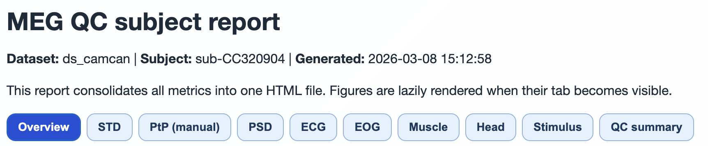
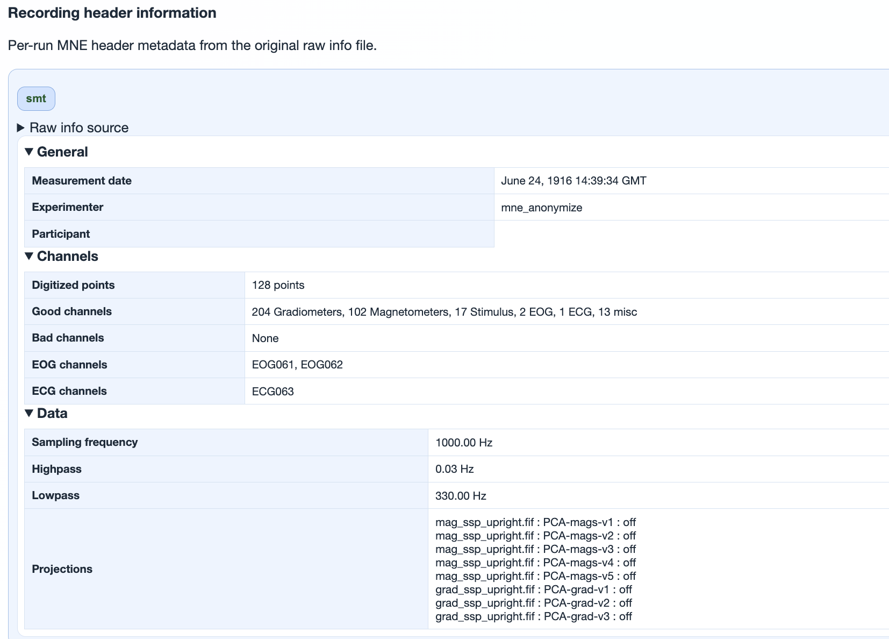
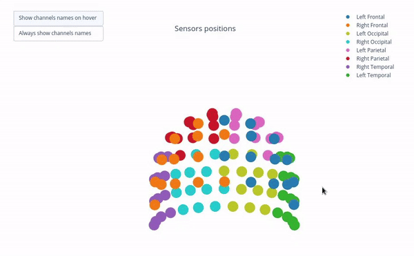
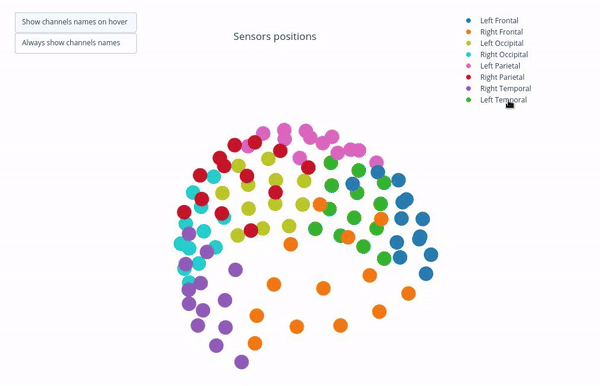
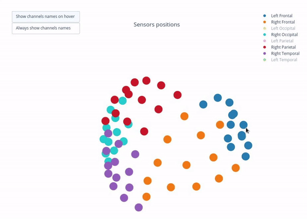

# Basic Information

Most subject metric tabs share the same baseline context blocks. This page explains those blocks.

## Subject report header and top-level tabs



This header confirms dataset/subject identity and report generation time, and exposes the top-level navigation tabs.

## Raw information (recording metadata)



This section summarizes key recording metadata such as:

- recording duration and sampling properties,
- basic acquisition/filter information,
- channel inventory and modality metadata.

## Sensor positions

Visual representation of MEG sensor geometry on the head model.

- Sensors are color-coded by lobe grouping.
- The same color convention is reused across multiple plots.

Interactive behavior:

1. rotate and zoom the 3D scene,
2. toggle lobe groups through the legend,
3. inspect channel labels by hover.







```{admonition} Sensor labels
Labels can be shown on hover or via "Always show channel names" in the interactive controls.
```
