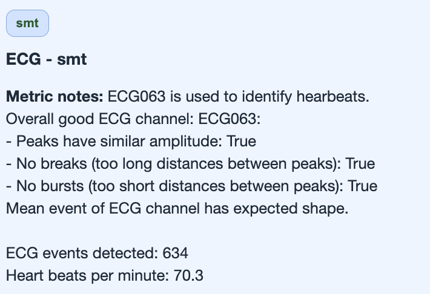
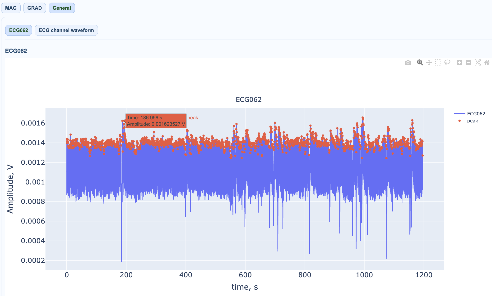
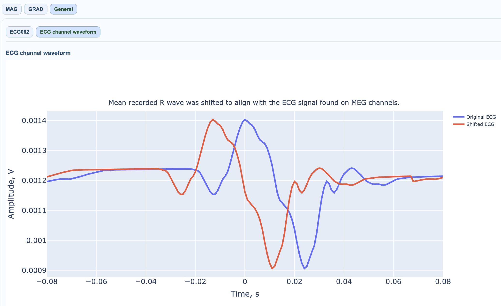
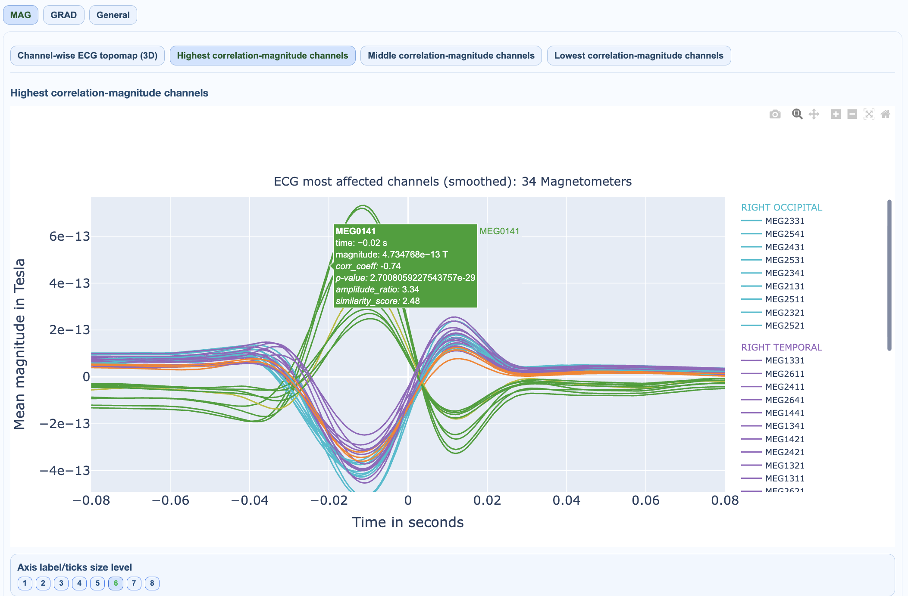
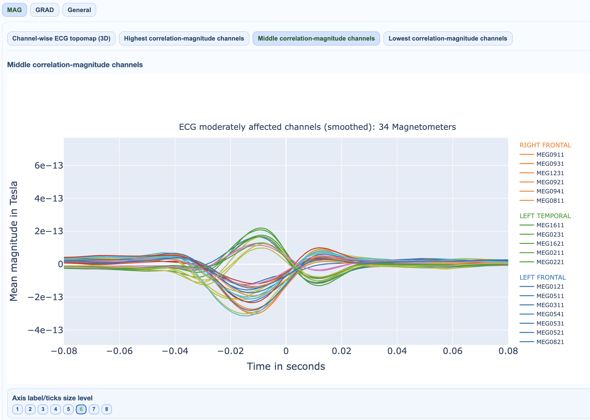
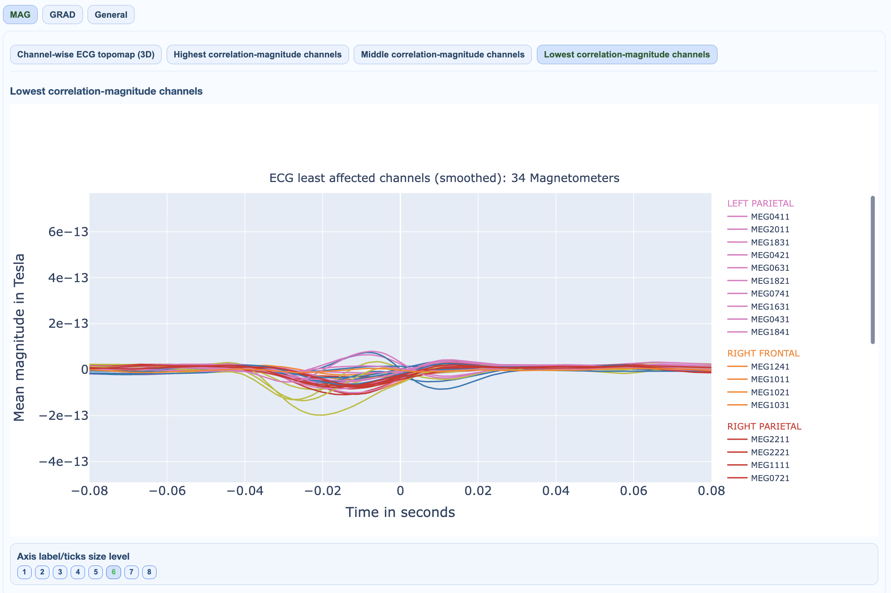
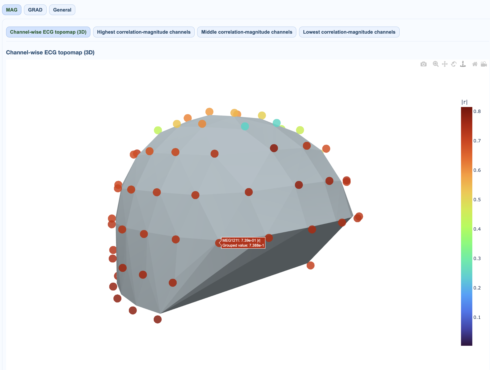

# ECG: Cardiac Contamination

ECG views quantify coupling between ECG reference activity and MEG channels.

For execution steps, see [Tutorial](../book/tutorial.md).

## Subject-report ECG views

| View | Encoding | What it reveals |
|---|---|---|
| ECG quality overview | reference-channel diagnostics | whether ECG-driven analysis is reliable |
| Raw ECG recording | time series context | signal quality and heartbeat structure |
| Mean R-wave template | averaged cardiac waveform | template quality used for coupling analysis |
| Affected-channel ranking | channels ordered by coupling magnitude | strongest vs weakest cardiac contamination |
| ECG topomap | coupling burden on sensor layout | spatial distribution of cardiac contamination |

### 1) ECG quality overview

Use this first to verify reference quality before interpreting channel rankings.

### 2) Raw ECG recording

Confirms cardiac waveform detectability and obvious corruption.

### 3) Mean R-wave template

A clean template indicates stable event-locked cardiac structure.

### 4) Channel ranking by contamination

Ranking separates high, medium, and low contamination channel sets.

### 5) ECG contamination topomap

Shows spatial concentration of ECG coupling burden.

## ECG in QC summary

`QC summary -> ECG` includes affected-channel counts and percentages (by task/run) derived from GQI task rows when available.

## QC implications

- high affected-channel percentage indicates stronger need for cardiac artifact handling,
- task-specific shifts may indicate condition-dependent contamination sensitivity,
- if reference quality is poor, interpret ECG burden with caution.

ECG contamination patterns are similar for MAG and GRAD channels, though the spatial distribution may differ slightly. The QC summary provides compact metrics for quick assessment across runs.
