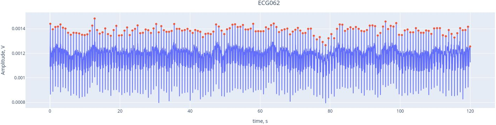
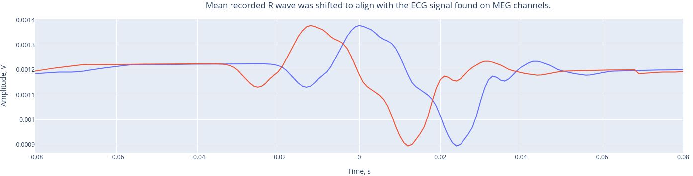
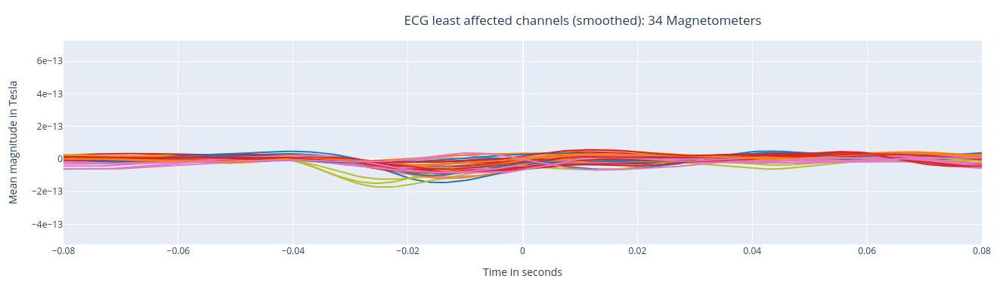
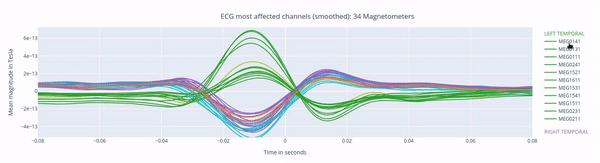

# ECG: Heartbeat Interference

Heartbeat interference is a common source of noise in MEG recordings. This intereference shows up as a rhythmic and periodic fluctuation, and it varies among participants (Gapontseva, 2023). 

  


First, we have a short overview with key criteria about the ECG signal recorded. MEGqc evaluates whther the heartbeats were recordnd in a consistently (similar amplitude), without missing beats (no breaks) and without false detections (no bursts). These aspects are relevant for determining if the channel issuitable heartbeat artifact identification. 

  


Here, we see the ECG signal (blue line) captured by the ECG channel (_ECG062_), with the red marking the R-peaks of each heartbeat. The R-peaks are components of the electrical activity of the heartbeat, and they can be easily used as reference points to identify heartbeat interference.
THanks to the interactive features, you can activate or deactivate the ECG signal and the peaks by clicking on the legend. YOu may also  zoom in by selecting a section within the figure.

  


The mean recorded R wave (from the ECG channel, real heartbeats) was shifted to align the _ECG signal found on MEG channels_. This alignment helps us understand the extend to which the heartbeats influence he MEG channels. Then, a Pearson correlation is performed between the __ECG signal found in each MEG channel__ and the reference mean signal of the ECG.

  


The following 3 plots highlights the MEG channels affected by heartbeat interference. Each line representes one MEG sensor, colour-coded by region. The plots are ordered from the most affected to the least affected. 

  

  

  


The interactive feature allows you to hide (1 click) and isolate (2 clicks) specific groups of sensors, as well as zoom-in on certai sections of the figure.

  

```{admonition} Want to check more reports?
:class: tip

Head back to the [main metrics page](../book/metrics.md) to explore the others!

``` 
