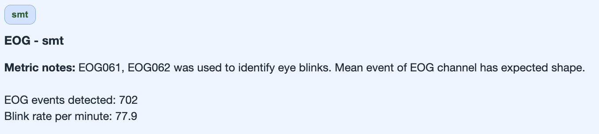
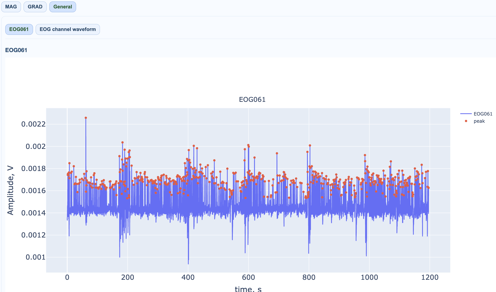
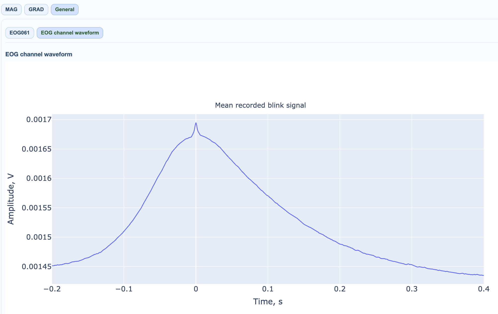
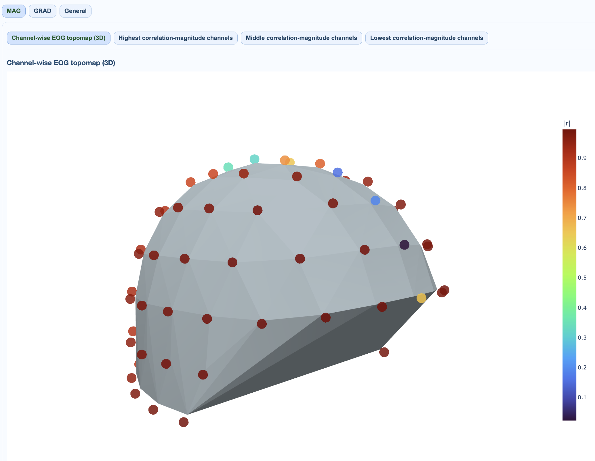
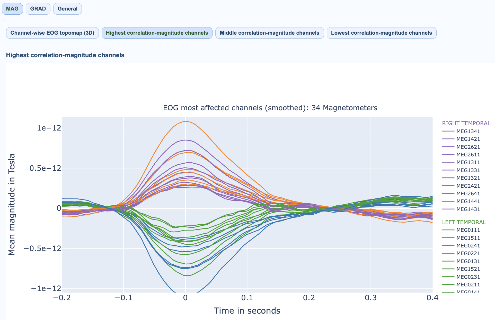
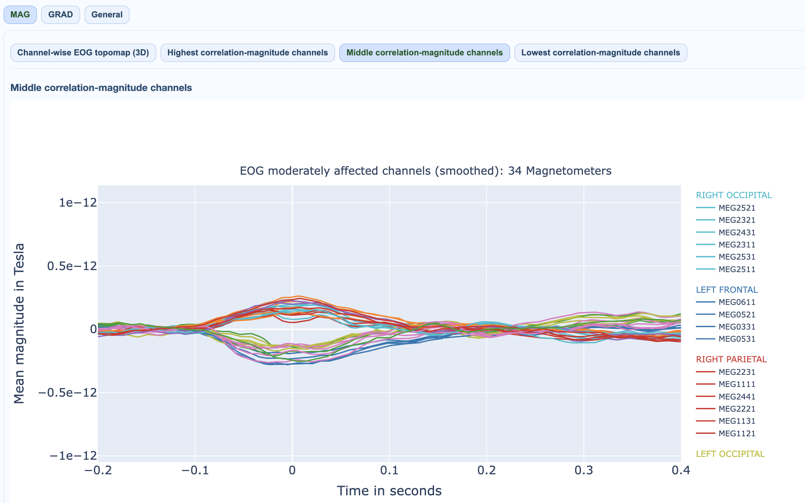
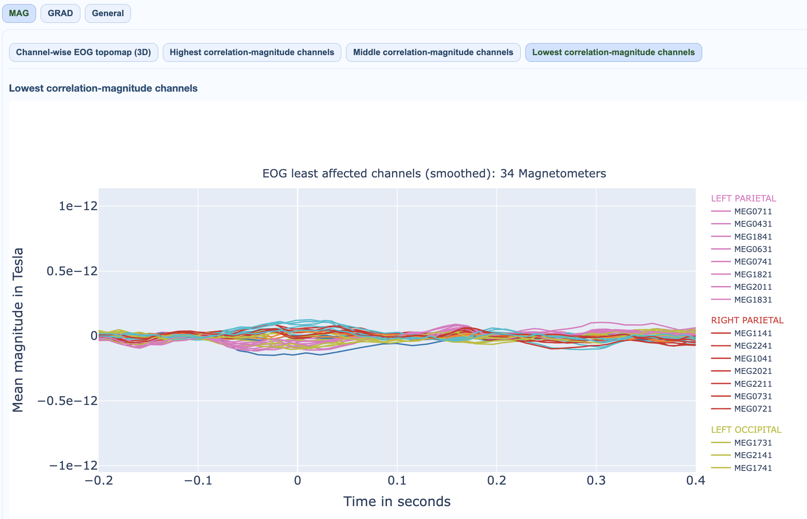

# EOG: Ocular Contamination

EOG views quantify coupling between ocular reference activity and MEG channels.

For execution steps, see [Tutorial](../book/tutorial.md).

## Subject-report EOG views

| View | Encoding | What it reveals |
|---|---|---|
| EOG quality overview | reference-channel diagnostics | whether blink/eye coupling analysis is reliable |
| Raw EOG recording | reference time series context | blink quality and reference noise |
| Mean blink template | averaged blink waveform | blink event consistency |
| EOG topomap | ocular burden over sensor layout | spatial spread of eye-movement contamination |
| Affected-channel ranking | channels ranked by ocular coupling | strongest vs weakest ocular contamination |

### 1) EOG quality overview

### 2) Raw EOG recording

### 3) Mean blink template

### 4) EOG contamination topomap

### 5) Channel ranking by contamination

## EOG in QC summary

`QC summary -> EOG` reports affected-channel counts and percentages (task/run-matched through GQI rows when available).

## QC implications

- broad high coupling suggests strong blink/ocular burden,
- anteriorly concentrated maps are common but still quantify burden for thresholding,
- combine with task timing and behavior context before exclusion decisions.

EOG contamination typically shows strongest effects in frontal sensors. The QC summary provides affected-channel counts and percentages matched to GQI rows when available.
