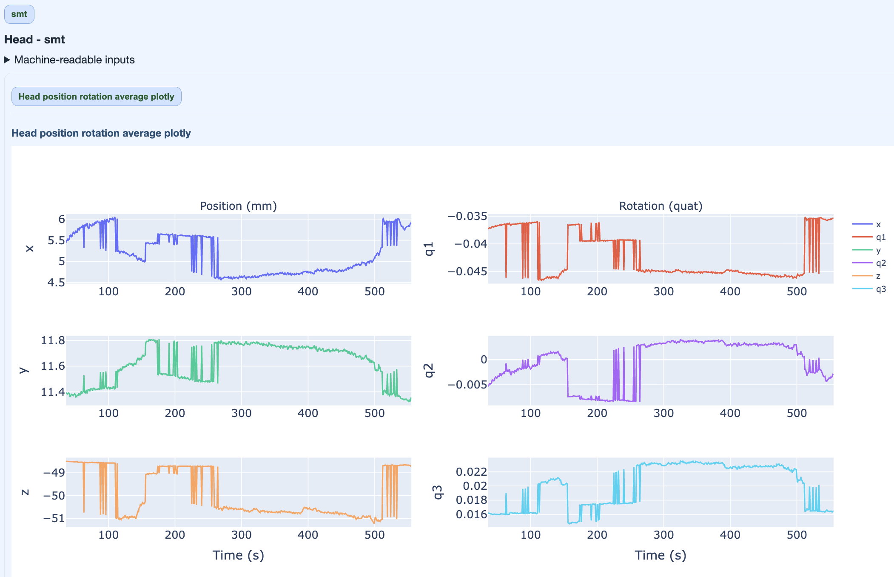

# Head Position and Movement

Head metric summarizes movement behavior using continuous head position indicator (cHPI) information when available.

For execution steps, see [Tutorial](../book/tutorial.md).

```{admonition} cHPI required
:class: warning

If cHPI traces are unavailable, Head outputs are not generated.

```

## Subject-report head view



What this panel is used for:

- quantify movement burden over recording time,
- identify segments with increased displacement,
- contextualize source-localization risk due to motion.

## QC implications

- sustained high movement can bias source estimates,
- short high-motion segments may be handled with segment-level QC,
- interpret head burden jointly with run/task context.

Head movement metrics include both translation (mm) and rotation (degrees) components. When cHPI data is available, MEGqc extracts continuous head position traces to quantify movement throughout the recording.
