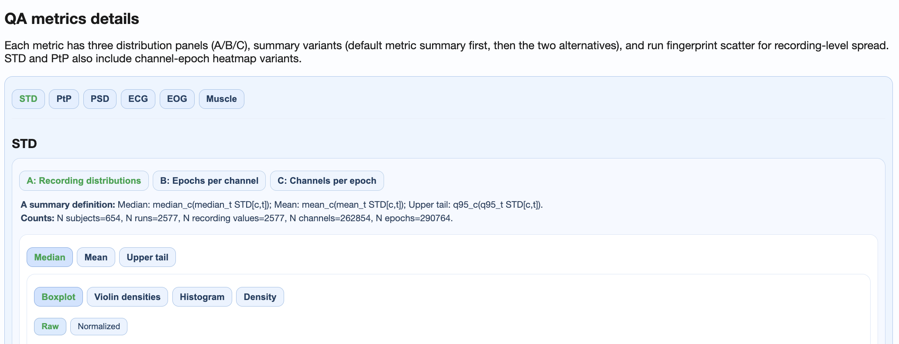

# Multisample Reports

Multisample reports compare quality metrics across **two or more datasets**. They enable cross-site comparisons, harmonization assessments, and multi-cohort quality evaluations.

For execution instructions, see the [Tutorial](../book/tutorial.md).

## When to Use Multisample Reports

Multisample reports are valuable for:

- **Multi-site studies:** Compare data quality across acquisition sites
- **Longitudinal studies:** Track quality changes across collection waves
- **Harmonization:** Assess whether datasets are comparable for pooled analysis
- **Benchmarking:** Compare a new dataset against established references

## Report Types

MEGqc generates two types of multisample reports:

| Report | Focus | Main Question |
|--------|-------|---------------|
| **QA Multisample** | Signal characteristics | "How do raw quality profiles compare across datasets?" |
| **QC Multisample** | Quality scores | "How do GQI scores and QC components compare across datasets?" |

## QA Multisample Report

### Structure

The QA Multisample report follows the same five-section structure as QA Group, but organized for cross-dataset comparison:

```
Top tabs: Combined (mag+grad) | MAG | GRAD
  └── Section tabs:
      ├── Summary distributions (merged across datasets)
      ├── Cohort QA overview (one subtab per dataset)
      ├── QA metrics across tasks (one subtab per dataset)
      ├── QA metrics details (shared distributions + dataset-specific heatmaps)
      └── Cumulative distributions (pooled ECDFs across all datasets)
```



### Key Features

**Summary Distributions:**
- All datasets shown together in violin/box plots
- Color-coded by dataset for easy identification
- Enables direct visual comparison of distribution shapes

**Cohort QA Overview:**
- One subtab per dataset
- Same heatmaps and ranking tables as single-dataset QA Group
- Switch between tabs to compare cohort patterns

**QA Metrics Details:**
- **Shared plots:** Cross-dataset distributions and fingerprints
- **Dataset-specific subtabs:** Heatmaps and topomaps per dataset
- Enables both aggregate and detailed comparison

**Cumulative Distributions:**
- All datasets pooled into ECDF plots
- Compare distribution tails across datasets
- Identify systematic between-dataset differences

### Interpretation Tips

- **Similar distributions:** Datasets are comparable; suitable for pooled analysis
- **Shifted distributions:** Systematic quality differences; investigate causes
- **Different shapes:** Different artifact patterns; may need dataset-specific QC thresholds

## QC Multisample Report

### Structure

The QC Multisample report compares GQI scores and QC components across datasets:

```
Top tabs: Combined (mag+grad) | MAG | GRAD
  └── Metric tabs: GQI | STD | PtP | PSD | ECG | EOG | Muscle
      └── Cross-dataset distribution comparisons for each component
```

### Key Features

**GQI Tab:**
- Side-by-side GQI score distributions per dataset
- Penalty breakdown comparisons
- Identify which datasets have better/worse overall quality

**Component Tabs:**
- Each QC component compared across datasets
- Helps identify which metrics drive between-dataset differences
- Support decisions about dataset-specific thresholds

### Interpretation Tips

- **Similar GQI distributions:** Datasets can use the same QC thresholds
- **Different penalty profiles:** Different artifact types dominate each dataset
- **Consistent component patterns:** Similar data quality characteristics

## Practical Workflow

### Step 1: Run QA Multisample
```bash
run-megqc-plotting --inputdata /path/ds1 /path/ds2 --qa-multisample
```

### Step 2: Assess comparability
- Check Summary Distributions for overall similarity
- Use Cohort QA Overview to identify dataset-specific outliers
- Use Cumulative Distributions to compare tails

### Step 3: Run QC Multisample
```bash
run-megqc-plotting --inputdata /path/ds1 /path/ds2 --qc-multisample
```

### Step 4: Harmonization decisions
- Compare GQI distributions
- Decide on unified vs dataset-specific thresholds
- Document quality differences for downstream analysis

## Preconditions

For meaningful multisample comparison:

1. **At least 2 datasets** are required
2. **Compatible analysis profiles** are recommended (same metrics enabled)
3. **Similar GQI parameterization** enables fair score comparison
4. **Comparable tasks/conditions** make task-dependent analysis interpretable

## Common Use Cases

### Multi-Site Harmonization

Compare quality profiles across sites to:
- Identify site-specific artifacts
- Establish site-specific QC thresholds if needed
- Document quality differences for publications

### Longitudinal Quality Tracking

Compare data collection waves to:
- Detect equipment degradation
- Identify protocol drift
- Track quality improvements after interventions

### Reference Benchmarking

Compare a new dataset against a well-characterized reference to:
- Validate data collection procedures
- Establish expected quality ranges
- Identify unexpected issues early
