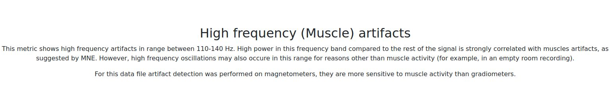
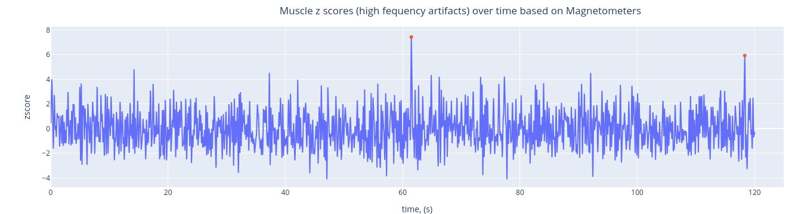

# Muscle (High-Frequency) Artifacts

Muscle metrics summarize high-frequency contamination and event-like bursts.

For execution steps, see [Tutorial](../book/tutorial.md).

## Subject-report muscle views

| View | Encoding | What it reveals |
|---|---|---|
| Muscle overview | module status and summary context | whether muscle metric was computed and available |
| Muscle event summary | event counts / burden summaries | intensity of high-frequency contamination |

### 1) Muscle overview

### 2) Muscle event panel

Interpretation:

- higher event counts/rates indicate stronger high-frequency artifact burden,
- clustered events suggest state- or task-specific muscle activation periods.

## Muscle in QC summaries

- Subject `QC summary -> Muscle`: run-level compact QC tables.
- QC Group `Muscle` tab: event count, event rate, and GQI muscle component comparisons.

## QC implications

- muscle burden is often complementary to PSD high-frequency patterns,
- evaluate event timing relative to task segments before exclusion,
- use with ECG/EOG/STD/PtP for multi-factor decisions.

Muscle artifacts appear in the high-frequency range (typically 110-140 Hz) and are detected as discrete events. The event count and rate provide quantitative measures for comparing across subjects and sessions.
