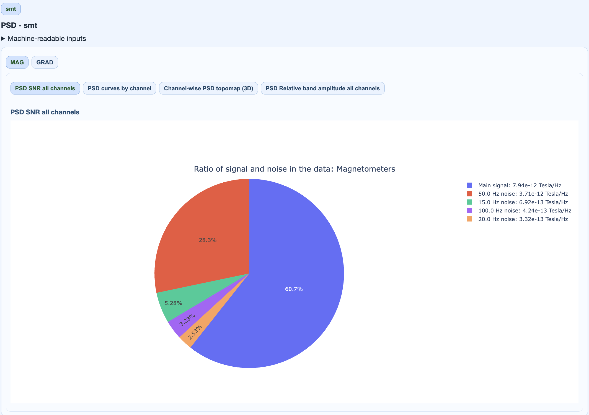
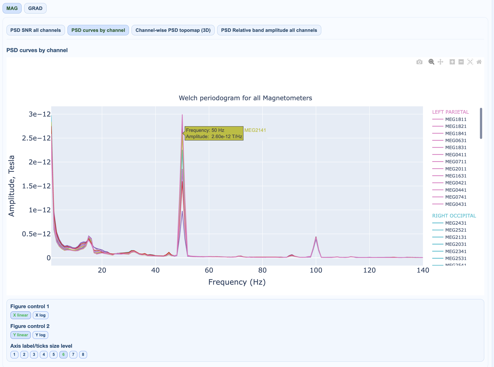
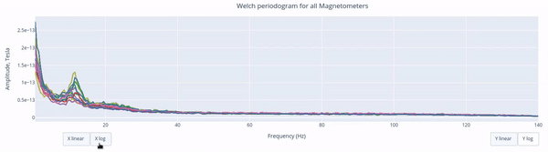
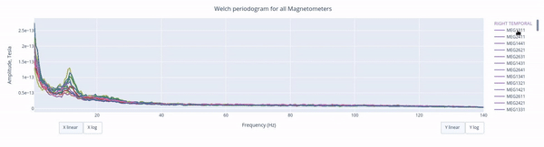
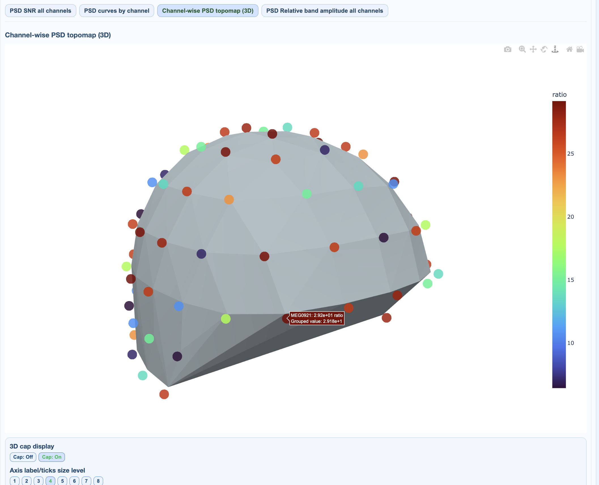
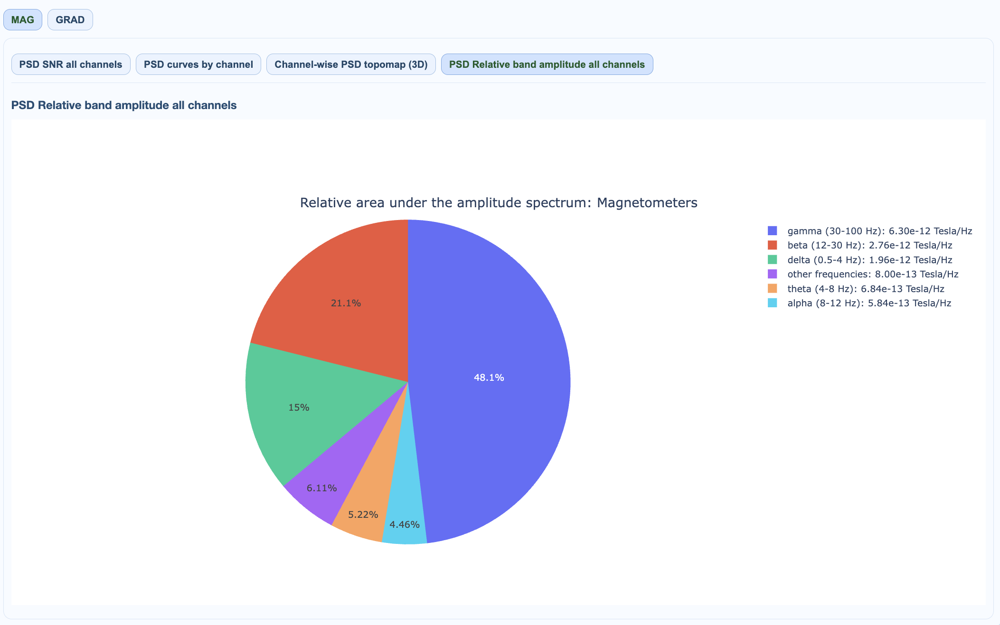

# Power Spectral Density (PSD)

Power spectral density (PSD) views characterize frequency-domain burden and are used to detect narrowband interference (for example mains harmonics) and broad-band contamination.

For execution steps, see [Tutorial](../book/tutorial.md).

## Subject-report PSD views

| View | Encoding | What it reveals |
|---|---|---|
| PSD SNR pie | signal vs detected noise contribution | proportion of spectral burden attributable to flagged noise frequencies |
| Welch periodograms | PSD curves per channel | peak frequencies, harmonics, and channel-specific contamination |
| Channel-wise PSD topomap | PSD-derived burden mapped to sensors | spatial concentration of spectral contamination |
| Relative band pie | delta/theta/alpha/beta/gamma/other contributions | dominant frequency content profile |

### 1) PSD SNR summary

Interpretation:

- high noise slice indicates strong narrowband contamination burden,
- useful for quick triage before detailed spectrum inspection.

### 2) Welch PSD detail by channel

Interpretation:

- narrow tall peaks at fixed frequencies suggest interference,
- channel-specific peaks suggest localized hardware/environment interaction,
- broadband elevation can indicate muscle/noise floor increase.

Interactive controls:

### 3) PSD topomap

Shows where PSD burden is strongest in sensor space.

### 4) Relative area by bands

Shows proportion of spectral energy in standard frequency bands and `other`.

## PSD summary table in `QC summary`

In `QC summary -> PSD`, MEGqc derives compact values from `SimpleMetrics`:

- **MAG/GRAD global noisy-frequency count**:
  number of globally detected noisy frequencies for that sensor type.
- **MAG/GRAD local noisy-channel burden**:
  channels with local PSD-noise evidence (`affected/total (percentage)`).

This summary is not a replacement for curves/topomaps; it is a compact QC descriptor.

## QC implications

- large local noisy-channel burden suggests channel-targeted QC,
- high global noisy-frequency count suggests global filtering/interference mitigation review,
- always interpret with task context and raw spectra.

The same spectral analysis applies to both MAG and GRAD channels. Common interference sources (power line harmonics, environmental noise) typically affect both channel types similarly.
