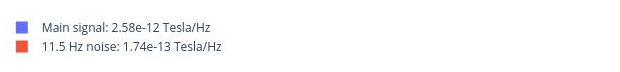
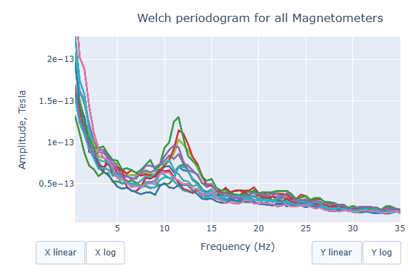
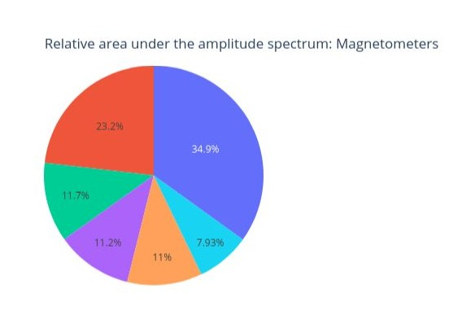

# Power Spectrum Density

The Power Spectrum Density describes how the power of a signal is distributed across different frequencies. It provides information on the strength or intensity of different frequency components. PSD calculation helps us to distinguish between brain activity and non-brain-related noise.


  
  


This circle chart represents the Signal-to-Noise Ratio (SNR). A high SNR indicates minimal corruption of the signal of interest by background noise. The prominent amplitude of the 11.5 Hz frequency labels it as potential noise.

  

The Welch periodrogram is commonly used to estimate the power of a signal at different frequency components.  
The X-axis represents the frequency range of the signal (from 0 to 140 Hz in this case) and the Y-axis represents the amplitude of the signal. 
Each colored line represents the PSD for the different magnetometers. As it was previously reported, there's a visible peak at 11.5 Hz in this example.

Interactive features in the HTML report allow toggling between linear a **linear** view or a **logarithmic** view of both the X-axis and the Y-axis independently. 


  
  


Also you can select from the legend box which sensors to show / hide (one click) or isolate on the figure (2 clicks).

  


Finally, each segment of the following circle chart represents the proportion of the total signal power that falls within each frequency range. How much does every frequency band contribute to the overall signal. 

  

  


```{admonition} Want to check more reports?
:class: tip

Head back to the [main metrics page](../book/metrics.md) to explore the others!

``` 


