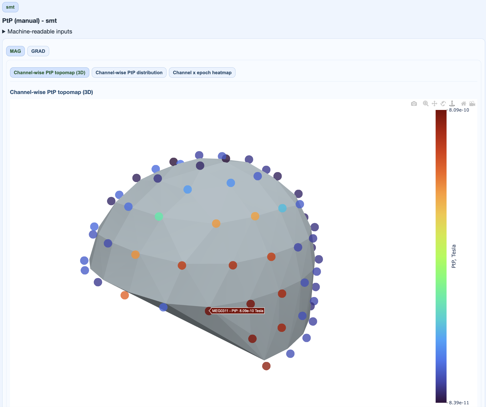
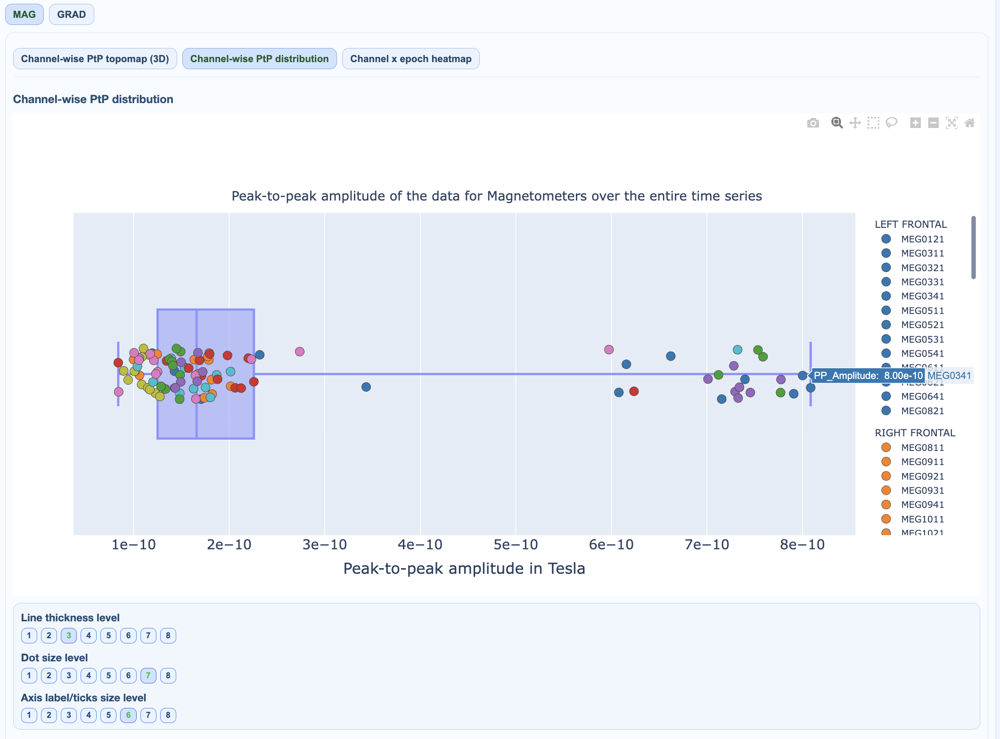
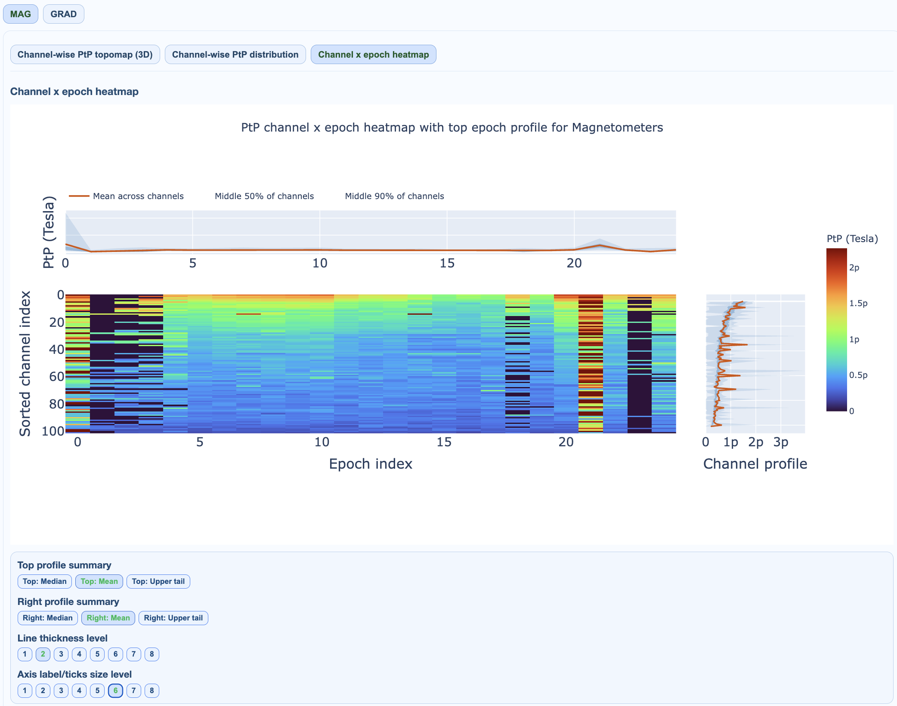

# Peak-to-Peak (PtP)

Peak-to-peak (PtP) amplitude is `max(signal) - min(signal)` over the analyzed interval. It emphasizes transient excursions and outlier bursts.

For execution steps, see [Tutorial](../book/tutorial.md).

## Subject-report PtP views

| View | Encoding | What it reveals |
|---|---|---|
| Channel-wise topomap (3D) | one PtP value per channel in sensor space | spatial pattern of excursion burden |
| Channel-wise distribution | one PtP value per channel | outlier channels and heavy-tail behavior |
| Channel × epoch heatmap | PtP per channel and epoch | when/where transient bursts occur |

### 1) Channel-wise PtP topomap (3D)

Interpretation:

- focal extremes indicate spatially localized transients,
- broad elevation suggests global bursts or movement-related effects.

### 2) Channel-wise PtP distribution

Interpretation:

- long upper tail indicates burst-prone channels,
- multi-modal distributions can indicate mixed channel populations.

### 3) Channel × epoch heatmap

Interpretation:

- vertical hot stripes: time-localized global excursions,
- horizontal hot stripes: channel-specific recurrent burst behavior,
- top/right profiles summarize epoch- and channel-level burden.

## PtP (manual) vs PtP (auto)

- **PtP (manual):** MEGqc’s internal PtP pathway and thresholds.
- **PtP (auto):** MNE-based automatic PtP pathway (when present).

Both can appear as separate tabs in subject reports. Compare them when validating threshold behavior.

## QC implications

- persistent high-PtP channels are bad-channel candidates,
- sparse high-PtP epochs can be rejected selectively,
- combine with STD/PSD to avoid rejecting physiologically plausible high-amplitude signal.

The same visualization patterns apply to both MAG and GRAD channel types. PtP (auto) uses MNE's built-in detection algorithm, while PtP (manual) uses MEGqc's custom thresholding approach.
