# QA Group Report

QA Group reports aggregate quality assessment metrics across all subjects in a single dataset. They help identify cohort-level patterns, outliers, and task-dependent quality shifts.

For execution instructions, see the [Tutorial](../book/tutorial.md).

## What QA Group Reports Show

The QA Group report answers the question: **"What are the quality patterns across my entire dataset?"**

While QA Subject reports focus on individual recordings, QA Group reports reveal:
- Dataset-wide metric distributions
- Subject and recording outliers
- Task/condition-dependent quality differences
- Spatial patterns across the sensor array

## Navigation Structure

The QA Group report uses a two-level tab hierarchy:

```
Top tabs: Combined (mag+grad) | MAG | GRAD
  └── Section tabs:
      ├── Summary distributions
      ├── Cohort QA overview
      ├── QA metrics across tasks
      ├── QA metrics details
      └── Cumulative distributions
```


### Top-Level Channel Type Tabs

| Tab | Content |
|-----|---------|
| `Combined (mag+grad)` | Pooled view across all channel types (use with caution due to unit mixing) |
| `MAG` | Magnetometer-specific analysis (units: pT) |
| `GRAD` | Gradiometer-specific analysis (units: pT/m) |

## Section 1: Summary Distributions

This section provides quick statistical overviews of each metric across all recordings.

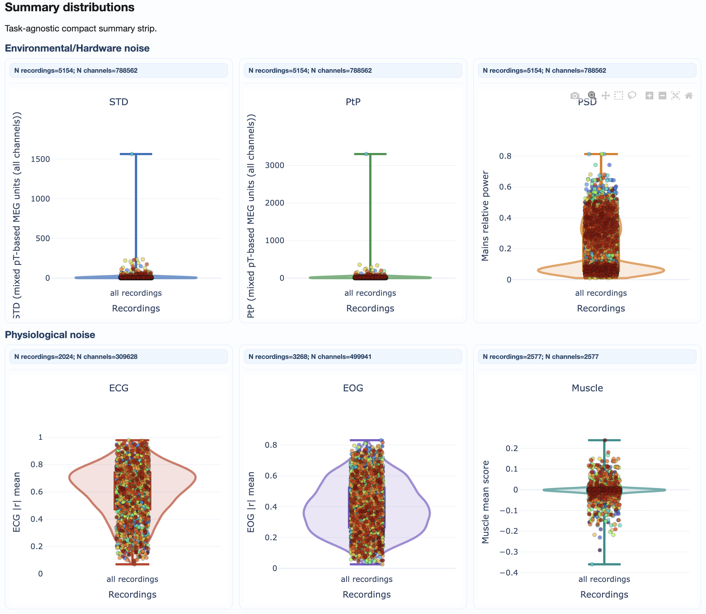

**What you'll see:**
- **Violin plots:** Show full distribution shape for each metric
- **Box plots:** Highlight median, quartiles, and outliers
- **Individual points:** Each recording plotted for identification

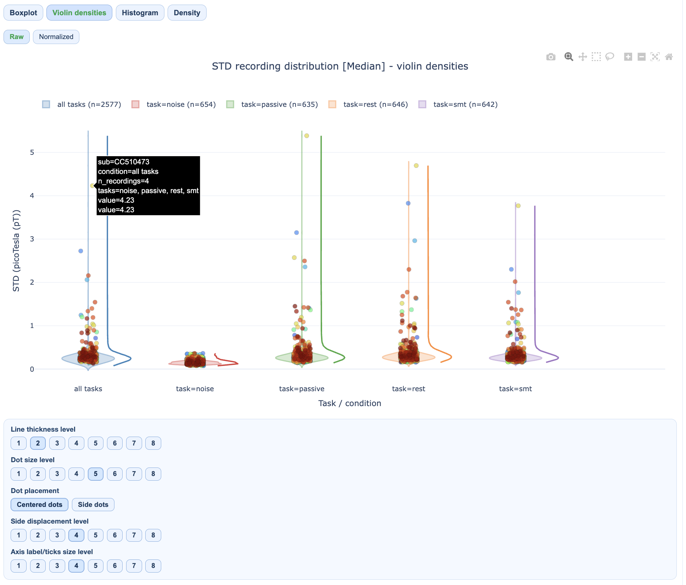

**How to interpret:**
- Wide distributions suggest high variability across recordings
- Outlier points above/below whiskers may need individual inspection
- Compare MAG vs GRAD tabs for sensor-type-specific patterns

## Section 2: Cohort QA Overview

This section provides integrated cohort summaries for quick triage.

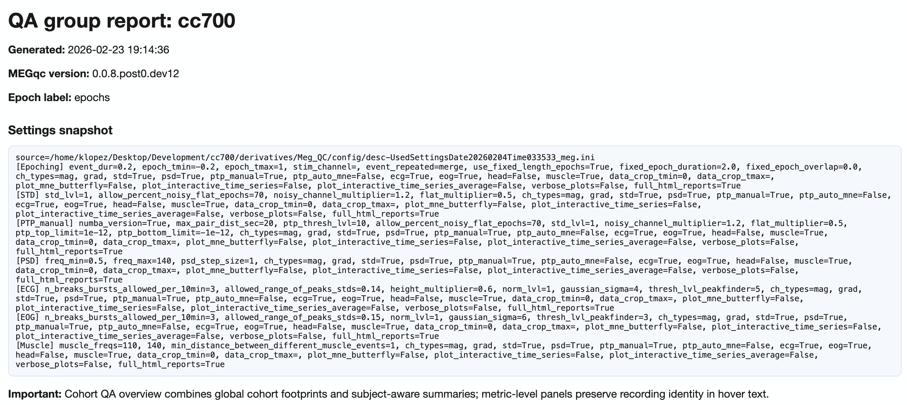

**Components:**

### Recording-by-Metric Heatmap
- Rows = recordings, columns = metrics
- Color = normalized burden (dark = higher burden)
- Hover for raw values

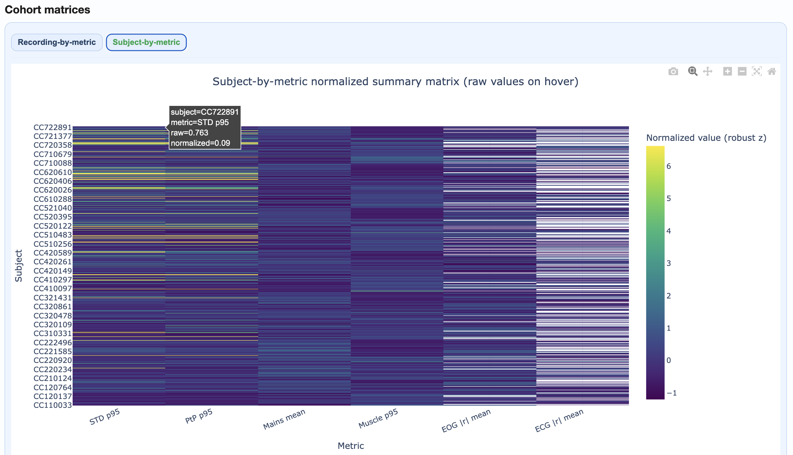

### Subject Ranking Table
- Subjects ranked by aggregated quality footprint
- Higher rank = more quality issues
- Click to identify problematic subjects

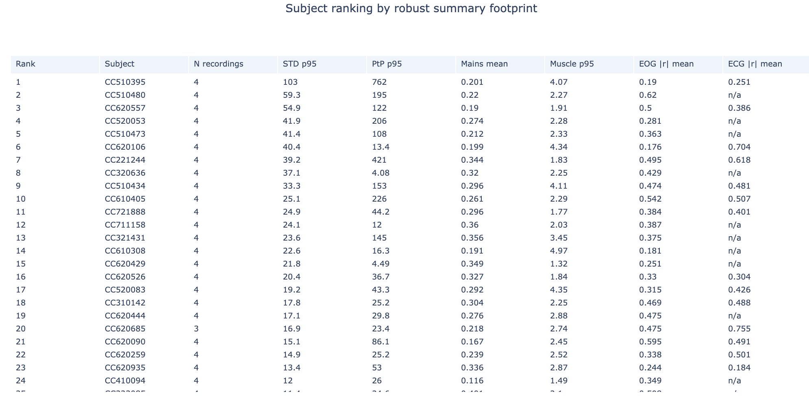

### Top Subject Epoch Profiles
- Small multiples showing epoch-wise patterns for highest-burden subjects
- Quickly identify temporal patterns in problematic recordings

## Section 3: QA Metrics Across Tasks

This section reveals how quality varies by task or experimental condition.

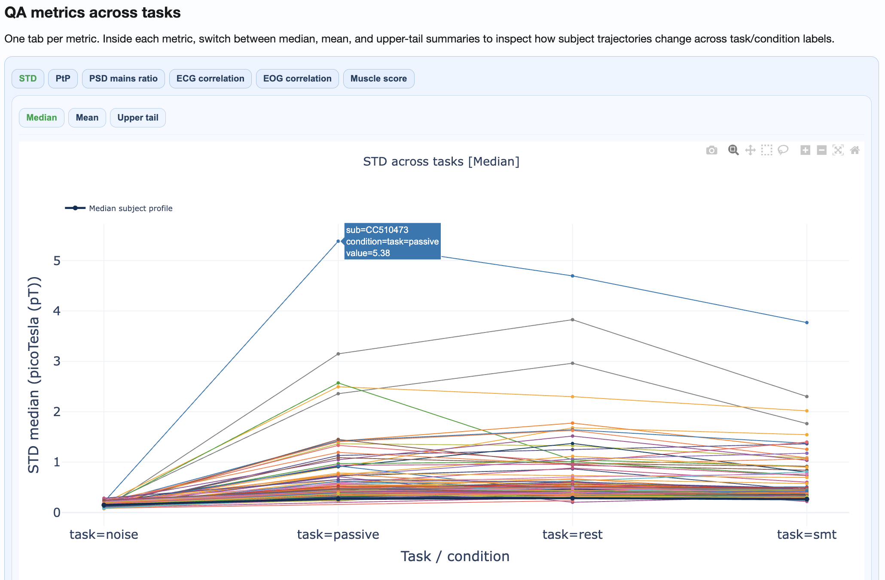

**What you'll see:**
- Separate distributions per task/condition
- Subject trajectories connecting the same subject across conditions
- Statistical comparison of condition effects

**How to interpret:**
- Parallel trajectories suggest consistent within-subject patterns
- Crossing trajectories suggest condition-specific effects
- Large between-condition shifts may indicate task-related artifacts

## Section 4: QA Metrics Details

This section provides deep-dive visualizations for each metric.

### Available views per metric:

| Metric | Views |
|--------|-------|
| **STD** | Distributions, fingerprint scatters, channel×epoch heatmaps, topomaps |
| **PtP** | Distributions, fingerprint scatters, channel×epoch heatmaps, topomaps |
| **PSD** | Frequency burden distributions, mains ratio distributions |
| **ECG/EOG** | Correlation burden distributions, topomaps |
| **Muscle** | Event burden distributions |

### Channel×Epoch Heatmaps

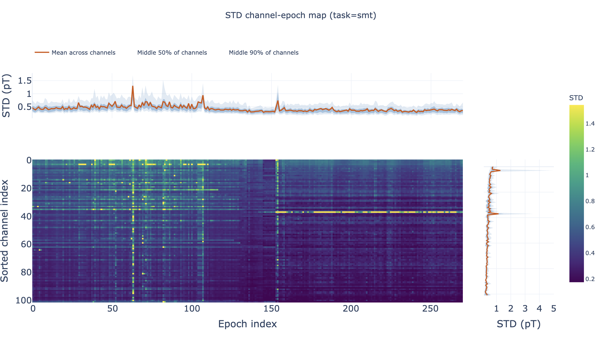

These heatmaps aggregate channel×epoch patterns across subjects:
- Rows = channels, columns = epochs
- Color = metric value
- Top profile = epoch summary, right profile = channel summary

### Pooled Topomaps

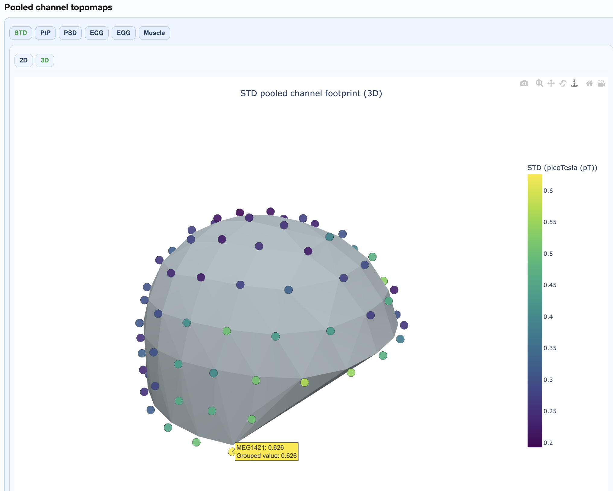

Sensor-space visualizations showing where quality issues concentrate:
- 2D flat topomaps for quick viewing
- 3D interactive topomaps for detailed exploration

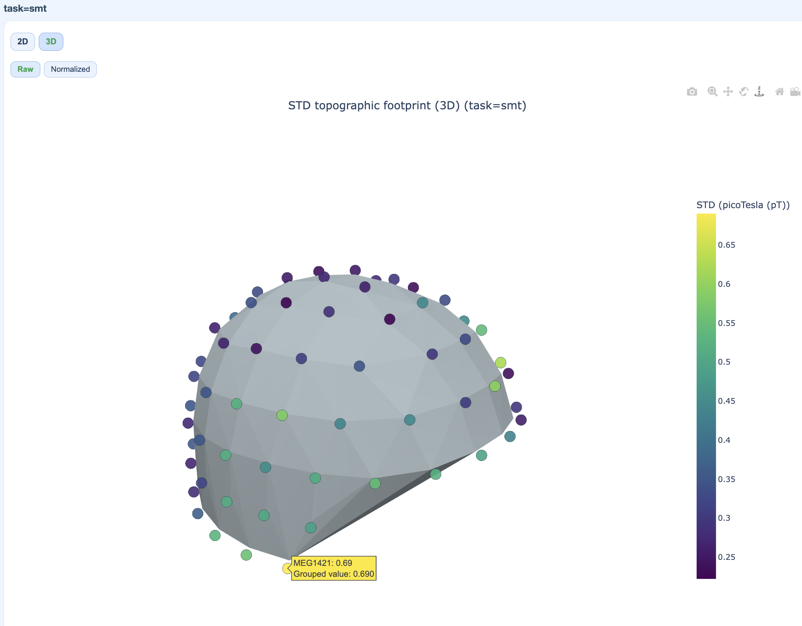

### PSD Frequency Views

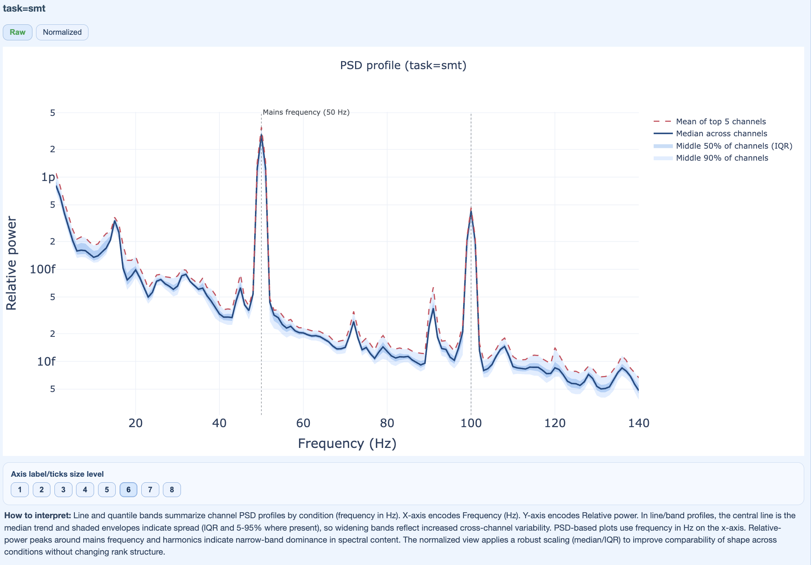

Show spectral patterns across the cohort:
- Mains frequency burden
- Harmonic patterns
- Broadband contamination

## Section 5: Cumulative Distributions

Statistical appendix with empirical cumulative distribution functions (ECDFs).

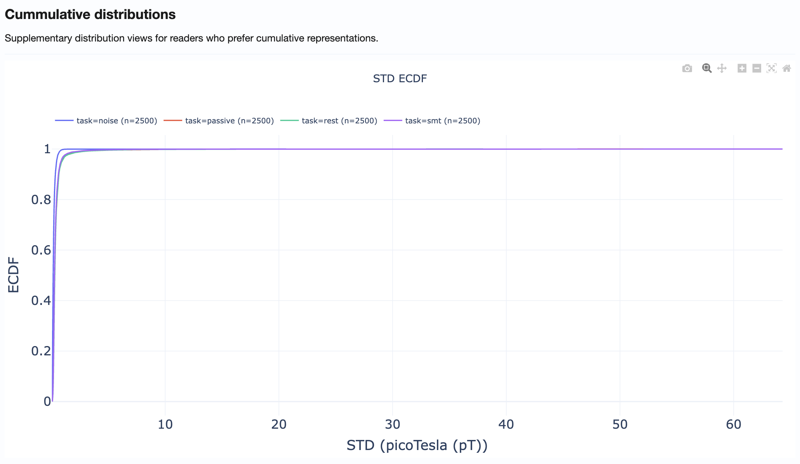

**How to use:**
- Compare distribution tails across metrics
- Identify what percentage of recordings exceed specific thresholds
- Support threshold selection for QC decisions

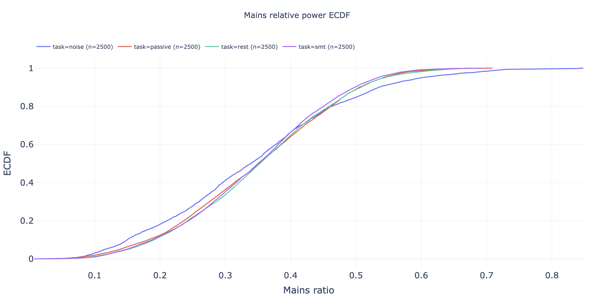

## Practical Reading Order

1. **Start in Summary Distributions** → Get quick overview of metric spreads
2. **Move to Cohort QA Overview** → Identify outlier subjects/recordings
3. **Check QA Metrics Across Tasks** → Test for task-dependent patterns
4. **Use QA Metrics Details** → Explain observed outliers with detailed views
5. **Use Cumulative Distributions** → Support threshold decisions

## Tips for Effective Use

- **Always compare MAG and GRAD tabs** when investigating issues
- **Use hover information** to identify specific subjects/recordings
- **Cross-reference with QA Subject reports** for detailed inspection of flagged recordings
- **Document findings** before proceeding to QC Group analysis
