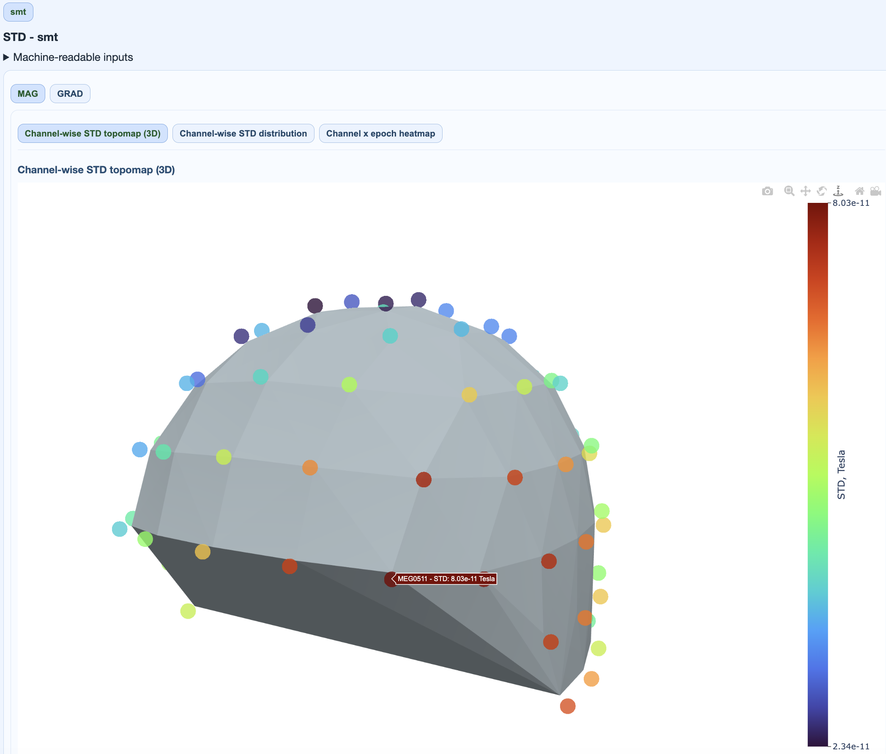
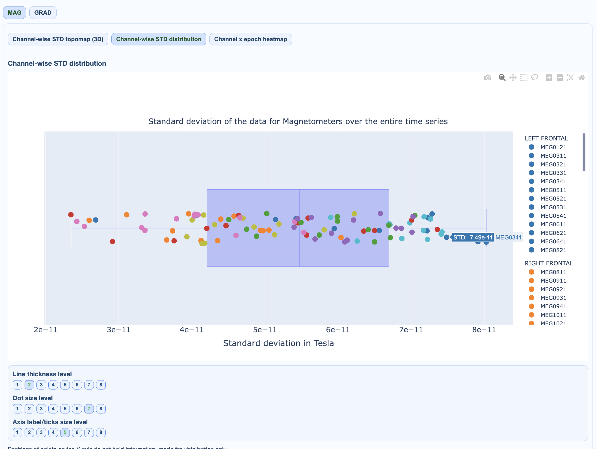
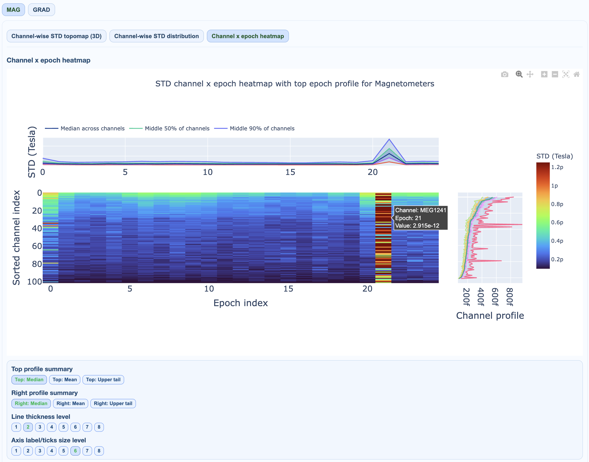

# Standard Deviation (STD)

Standard deviation (STD) quantifies signal variability amplitude. In MEGqc, STD is used to detect noisy/flat channels and temporal non-stationarity.

For execution steps, see [Tutorial](../book/tutorial.md).

## Subject-report STD views

| View | Encoding | What it reveals |
|---|---|---|
| Channel-wise topomap (3D) | channel value mapped to sensor location | spatial concentration of high/low variability |
| Channel-wise distribution | one STD value per channel | global spread, upper-tail burden, flat-channel cluster |
| Channel × epoch heatmap | cell = channel STD in one epoch | non-stationary bursts and persistent channel problems |

### 1) Channel-wise STD topomap (3D)

Interpretation:

- focal hot areas suggest localized sensor burden,
- broad elevated regions suggest global contamination periods,
- very low islands can indicate flat/saturated channels.

### 2) Channel-wise STD distribution

Interpretation:

- wide right tail indicates a subset of highly variable channels,
- compressed distribution near zero suggests widespread attenuation or flat behavior,
- compare MAG vs GRAD because native units differ.

### 3) Channel × epoch heatmap

Interpretation details:

- **vertical bands**: many channels affected at specific times (transient global events),
- **horizontal bands**: persistent problematic channels across many epochs,
- **top profile**: epoch-level burden summary (across channels),
- **right profile**: channel-level burden summary (across epochs).

## QC implications

- channels repeatedly high in the right profile are candidates for bad-channel labeling,
- isolated epoch spikes in top profile suggest selective epoch rejection,
- mixed patterns should be cross-checked with PtP and PSD before hard exclusion.

The same visualization patterns apply to both MAG and GRAD channel types, though the absolute values differ due to different physical units (pT vs pT/m).
