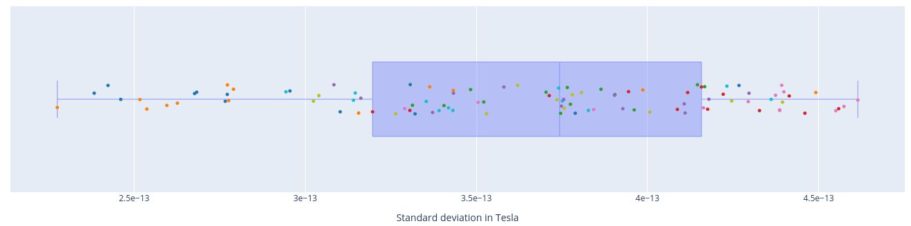
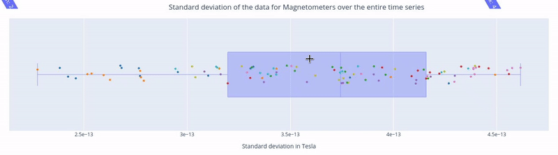
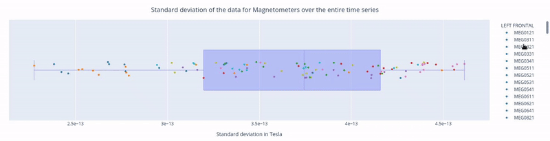
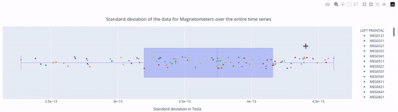
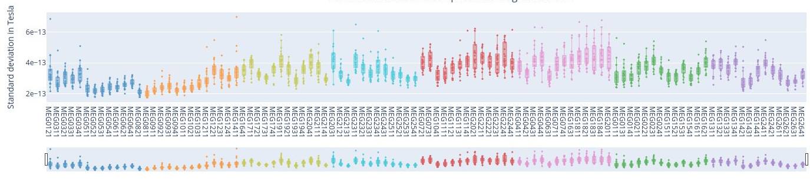
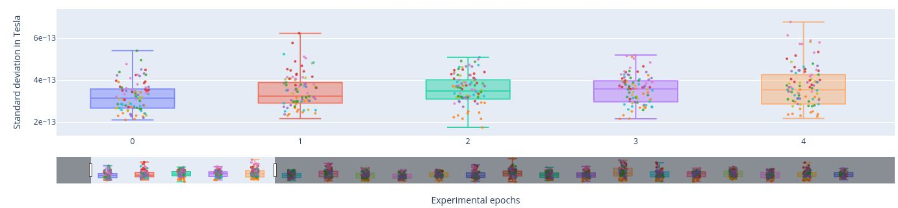

# Standard deviation of the data

The Standard Deviation (STD) metric measures the variability of each channel. Channels with unusual high or low STD compared to others, might indicate potential malfunctions (Gapontseva, 2023).

## 1. Standard Deviation over the entire time series
In the first figure, each dot represents the standard deviation of a Magnetometer channel over **the entire time series**.

- The sensors are colored according to the regions of the Sensor Distribution plot.
- The position of the points on the Y axis are not meaningful, they are just for visualization purposes. 

Interactive features:
- Hovering over a dot reveals the standard deviation value of a specific sensor and the sensor label (e.g. 3.62e-13 | _MEG1741_). - Hovering over the blue square gives you the value of:
    - The highest and lowest edge values of the boxplot's whisker: any data point outside that range is flagged as **noisy** or **flat**, indicating a potential outlier.
    - The first quartile (Q1) and the third quartile (Q3), which represents the 25th and 75th percentile of the data.
    - The media (50th percentile) value of the dataset.

  

- Clicking on the legend box allows you to hide or reveal sensors of a specific lobe. 

  

- Clicking, holding and dragging the left mouse button over a section of the figure allows to you zoom in. The home button restores the default view.

  

## 2. standard Deviation over Sensors

Each box plot corresponds to a sensor, and each point represents the standard deviation for that sensor during an individual epoch.

  

Epochs are created by segmenting the continuous MEG recording basend on triggers in the dataset. By hovering over any of the points, users can read the specific epoch represented. Sensors with points outside the whiskers indicate higher variability, potential artifacts, or irregularities in specific epochs. 

Interactive features:

1. Selecting lobes
- Clickin once on a legend block hides a group of sensors.
- Clicking again reveals the previously hidden sensors.
- Clicking twice isolates that group.

  

2. Scrolling through lobes
- Rich-click and drag on the horizontal bar to scroll though the sensors, enabling a more detailed view. This feature might be a bit slow when many sensors are displayed simultaneously.

  

- For example, the following figure shows 6 sensors from the Left Frontal area.

  

## 3. Standard Deviation over Epochs
Each box plot represents a single epoch, and each dot the standard deviation value for every specific sensor during that epoch. The sensors are color coded.  
This type of figure is most relevant for experiments with relevant time events.  

- To zoom in, use the horizontal bar at the bottom to zoom in on a subset of sensors. This visualization helps to visually focus on a subsets of epochs.  

  

- Hovering over with the mouse, the value and label of every sensor appears, along with the interquartile range values. 

  

# Go back

Go back to the [metrics main page](../book/metrics.md)
