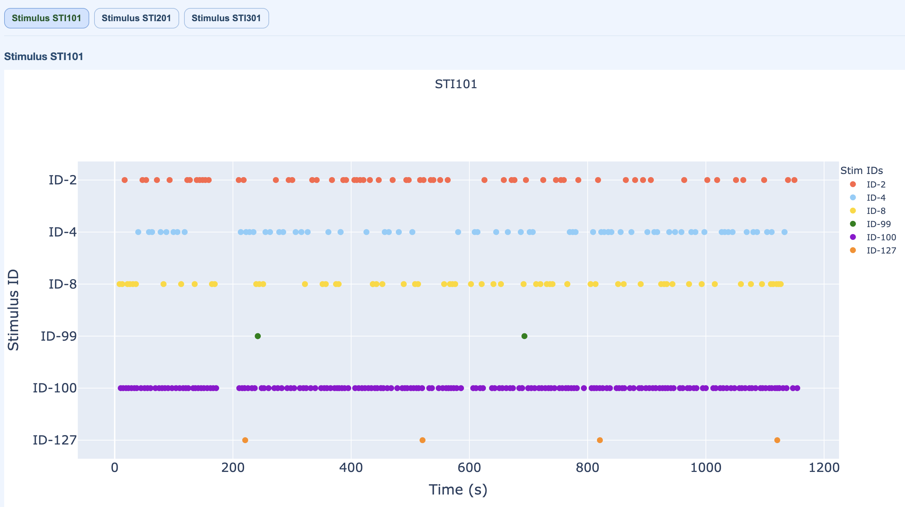

# Stimulus Channels

Stimulus view summarizes detected trigger channels and event structure used for epoching.

For execution steps, see [Tutorial](../book/tutorial.md).

## Subject-report stimulus view

What is shown:

- stimulus channel IDs (one channel per row on Y axis),
- event IDs/types per channel,
- event counts,
- epoching context for event-based segmentation.

## Why this view is critical

Event integrity affects all epoch-dependent metrics (for example STD/PtP/ECG/EOG epoch summaries).

Use this panel to verify:

- the expected trigger channels are present,
- event IDs are plausible,
- no obvious trigger sparsity or corruption is present.

## QC implications

- missing or malformed trigger structure can force fixed-length epoch fallback,
- task/run comparisons are less interpretable when event definitions differ,
- trigger anomalies should be documented before downstream QC decisions.

When stimulus channels are unavailable or unreliable, MEGqc falls back to fixed-length epoching (configurable via `use_fixed_length_epochs` and `fixed_epoch_duration` in settings). The stimulus view helps identify whether event-based or fixed-length epoching was used.
