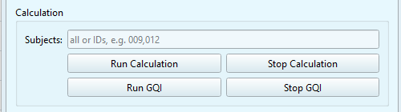

# GUI: GQI Module

The GQI module allows you to re-run the GQI calculation without re-running the calculation module. This will allow you to use different **GQI parameters** without having to re-analyze the whole dataset. Every time you run the GQI module, it will create `attempts`, which will allow you to diferentiate in-between different runs of the GQI module.

```{dropdown} GQI and the Summary Reports

As mentioned previously:
* The [Global Quality Index (GQI)](../book/gqi) is a single overall estimate of data quality for each subject.
* Each time you run the calculation module or the GQI module, it generates a new `summary reports` folder. This folder contains a summary of metrics and GQI values of your dataset. Every run creates a new summary report folder, stored as a numbered `attempt`. The `summary reports` folder contains the following content:
  * config: it will contain the settings used for each `attempt`.
  * group_metrics: Includes the TSV files and a PNG plot of the GQI distribution for each `attempt`.
  * global_quality_index_n = A folder for each attempt *(n = number of attempt)*, containing one subfolder per subject. These subfolders include GQI scores and the outputs of individual metrics.

```


with the **Global Quality Index (GQI)** of your dataset. 


