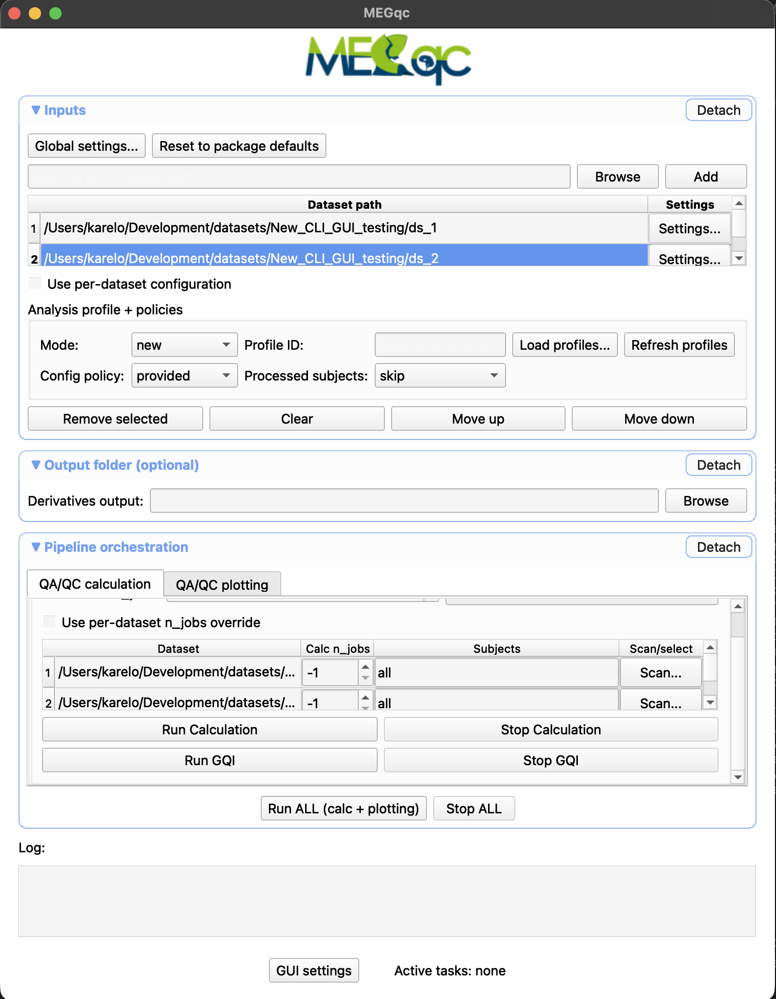
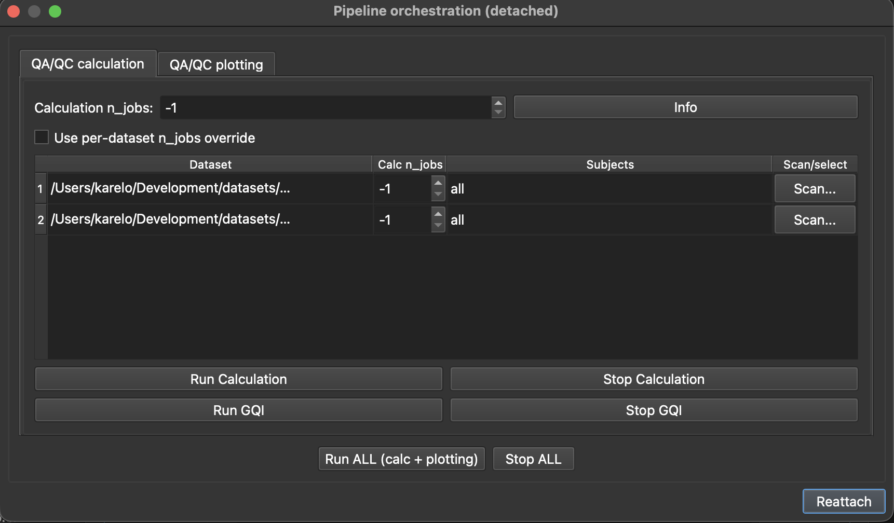

# Calculation Module (GUI)

Open MEGqc:

```bash
megqc
```

Main window:



Calculation module panel:



## Step 1: Configure inputs

In **Inputs**:

- add one or multiple BIDS dataset paths,
- optionally reorder/remove datasets,
- select global settings or enable `Use per-dataset configuration`.

## Step 2: Set analysis profile and policies

In **Analysis profile + policies**:

- `Mode`: `legacy`, `new`, `reuse`, `latest`
- `Profile ID`: optional or required depending on mode
- `Config policy`: `provided`, `latest_saved`, `fail`
- `Processed subjects`: `skip`, `rerun`, `fail`

## Step 3: Optional output root

In **Output folder (optional)** set `Derivatives output` only when outputs should be outside dataset roots.

## Step 4: Configure calculation runtime

In **QA/QC calculation** tab:

- set global `Calculation n_jobs`,
- optionally enable per-dataset `n_jobs` override,
- use per-dataset **Scan/select** for subject selection.

## Step 5: Execute

- **Run Calculation**: calculation only.
- **Run GQI**: recompute GQI attempts from existing metrics.
- **Run ALL (calc + plotting)**: full orchestration (calculation then plotting).

Stop buttons abort active tasks.

## Example scenarios

### Scenario A: one dataset, all subjects, new profile

- add dataset,
- set mode `new` (optional explicit profile ID),
- keep subjects=`all`,
- click **Run Calculation**.

### Scenario B: two datasets, different configs and subjects

- add datasets A and B,
- enable per-dataset config,
- assign each settings file,
- use **Scan/select** per dataset,
- click **Run Calculation**.

### Scenario C: full pipeline in one action

- configure plotting choices in **QA/QC plotting** tab,
- click **Run ALL (calc + plotting)**.

```{admonition} Runtime safety behavior
:class: tip

When one run starts, other run buttons are disabled until completion or stop.

```
