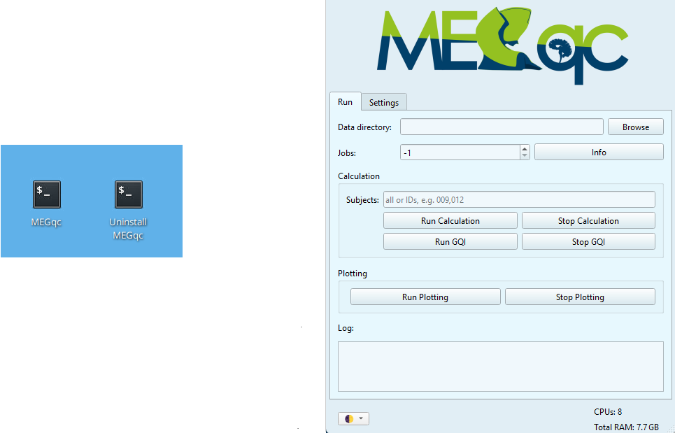
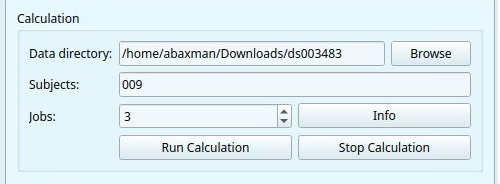
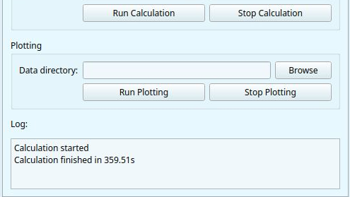

# GUI: Calculation Module

Thanks to the graphical user interface (GUI) you will be able to run MEGqc and generate reports without using the terminal. 
To open the GUI, click the MEGqc shortcut on your Desktop. Then the MEGqc GUI will open alongside a bash terminal.
 
 _(the terminal will display more detailed information about the on-going processes, but you can safely close it)_




```{admonition} GUI visual theme
:class: tip

Click the left-corner icon of the GUI to open a dropdown list with all available visual themes. This will only affect the visual display of the GUI. This list also includes themes with high-contrast options. 

```

## 1. Basic parameters
To run the calculation module you need the following basic parameters.

* **Data directory:** you can *paste* the path to your dataset or click `Browse` to select the folder manually.
* **Subjects:** you can write `all` to analyze every subject, or enter a specific ID (e.g., `009` for `sub-009`).
* **Jobs:** Choose how many parallels jobs to use during the processing of your data. The default option is `1`, but you can increase the speed of the processing by increasing the number of parallel Jobs.



<br>

```{dropdown} How do I know the right amount of parallel Jobs?

  * MEGqc automatically detects and displays the number of cores ('CPUs') and the total available RAM (see the lower-corner of the GUI).
  * The `Info` button will give you personalized recommendations based on system memory.
  * You may also use `-1` to use **all available cores**. 

``` 

## 2. Settings
The `Setting` tab allows you to customize your analysis.


The settings are grouped into _categories_:

* The **General** group of settings allows you to select the channel types (`mag` or `grad` or both), and the specific metric to compute (e.g. `STD`, `PSD` or `PTP`). You can also apply your analysis to a smaller snippet of data by modifying  `data_crop_tmin` and `data_crop_tmax`.
* The **Filtering** and **Epoching** groups of settings allow you to edit how the filtering and epoching should be applied, such as `high-pass` / `low-pass cut-offs frequencies` and time windows.
* **Metric-specfic settings:** every metric includes their own editable group of settings, such as how many standard deviations from the mean to use as a threshold, the edge frequencies for PSD calculation, or the minimun PTP amplitude to count as a peak.

When you hover over each editable parameter, you'll see a short description along with the default value. Their **default values** were calculated by the ANCPLab to be compatible with a broad variety of datasets.
 
 _(if you want a detailed explanation of all the settings available, visit the [settings page](../extra/settings))_ 

 
<br>

## 3. Run Calculation
Once you've set your parameters (Data directory, Subjects and parallel Jobs) click `Run Calculation`. The **Log** window will display the ongoing process, including updates and any errors. You can also find more detailed information in the terminal window.



<br>

### "There are already config files used for this data set"

If you have already processed the dataset, the **terminal** will ask you if you want to use again the same config files with the previous customized settings.

The terminal will display a **numbered list** of paths to previous config files used for the data set.
Then it will ask you to `Enter the number of the config file you want to use, or press Enter to use the default one`.
* Enter the corresponding **number** of the config file path you want to reuse. The terminal will ask you to confirm if you want to **RERUN** these subject with the same config parameters.
* If you don't want to use any previous config file, just press Enter to continue with your default setting


```{warning}

Rerun datasets, independently of the users' decision over the settings, seems to be failing. The calculation doesn't continue, the terminal becomes unresponsive.

``` 


## Congratulations! You've successsfully run the calculation module! 🎉

Once the process is finished, a new folder called `MEG_qc` will be created inside your dataset's `derivatives` folder . This folder will contain one subfolder per subject, with machine-readable files (**.tsv** and **.json**) for each metric, run and task. If you're following this tutorial, the path to the MEGqc derivatives might look like this:

```bash
/path/to/your/dataset/ds003483/derivatives/Meg_QC/calculation/sub-009/
```

# Next section
In the next section, you'll learn how to use the calculation derivatives to generate the **HTML reports** with MEGqc's plotting module.

<br>


