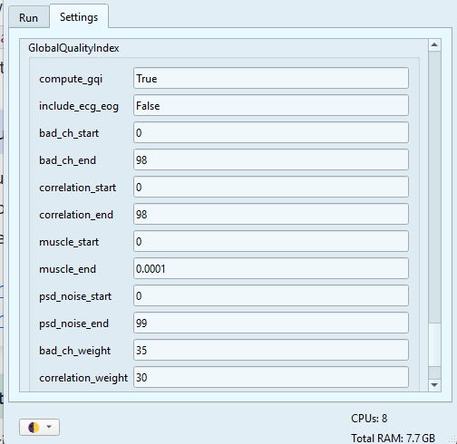

# GUI: GQI Module

The Global Quality Index (GQI) module allows you to re-calculate the [GQI](../extra/gqi.md) with different GQI calculation **settings** without re-running the calculation module. Each time you run the GQI module, it modifies the `summary reports` folder creating new `attempt`s.  

```{dropdown} The Summary Reports (recap)

As mentioned previously, the summary reports folder contains a series of "reports" with the summary of metrics and the GQI values of each participant of your dataset. This folder can be found within the derivatives folder of your dataset.

The summary reports folder contains the following subfolders and files:
* **config:** it will contain the specific settings files used for the GQI calculation. Each `attempt` creates a new settings file.
* **group_metrics:** Includes a TSV file and a PNG plot of the GQI distribution of the dataset. Each `attempt` creates a new pair of TSV and PNG files.
* **global_quality_index_n:** A folder containing one subfolder per subject. These subfolders include a JSON file with the outputs of individual metrics and the GQI scores. Each `attempt` creates a whole new folder _(n = number of attempt)_.

```
## 1. Basic parameters

As with the Calculation module, there are some parameters that are necessary to run the GQI module:


* **Data directory:** you can *paste* the path to your dataset or click `Browse` to select the folder manually.
* **Subjects:** you can write `all` to analyze every subject, or enter a specific ID (e.g., `009` for `sub-009`).
* **Jobs:** Choose how many parallels jobs to use during the processing of your data. The default option is `1`, but you can increase the speed of the processing by increasing the number of parallel Jobs.

<br>

```{dropdown} How do I know the right amount of parallel Jobs?

  * MEGqc automatically detects and displays the number of cores ('CPUs') and the total available RAM (see the lower-corner of the GUI).
  * The `Info` button will give you personalized recommendations based on system memory.
  * You may also use `-1` to use **all available cores**. 

```

## 2. Advance Settings
The `Setting` tab allows you to customize your GQI calculation. The specific settings for the GQI are at the very end of the list. 





The GQI calculation is based on a penalization system defined by a system of `weights` and `thresholds`. Every "source of noise" has its own `weights` and `thresholds`, which are customizable, but you may also use the default values. The weight is the maximun possible penalty, and represents its relative importance for the GQI. The two thresholds are the `start` and the `end`:
- If a metric exceeds the `start` (predefined **minimun** threshold), a **portion** of its weight is substracted from the GQI.
- If the metric exceeds the `end` (predefined **maximun** threshold), the **total** weight will be penalized.

If you want to learn more about the penalization system, visit the [GQI section](../extra/gqi.md).

Once you have adjust your settings, don't forget to click on the `Save Settings` button at the very end. 

## 3. Run GQI calculation
Once you have define your basic parameters and advance settings, you can click on the `Run GQI` button. The Log window will display the ongoing process, including updates and any errors. You can also find more detailed information in the terminal window.

You will find the results within the summary reports folder as a new numbered attempt.

```bash
path\to\your\dataset\derivatives\Meg_QC\summary_reports
```

## Congraulations

By now, you've learned to run the **metrics calculation**, generate the **html reports** and create the **summary reports** with the GUI.
Now you can continue with the **CLI** workflow, you can go back to the [tutorial section](../book/tutorial.md) or explore the [Extras](../book/extra.md)


