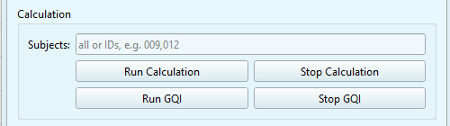

# GUI: GQI Module

The GQI module allows you to re-calculate the GQI with **different parameters** without re-running the calculation module.  

```{dropdown} The Summary Reports

As mentioned previously:
The summary reports folder contains the following subfolder and files. Every time you re-run the GQI module (more on that below) you will create a new `attempt` within the summary reports.
* **config:** it will contain the specific settings used for the GQI calculation. Each `attempt` creates a new settings file.
* **group_metrics:** Includes a TSV file and a PNG plot of the GQI distribution of the dataset. Each `attempt` creates a new pair of TSV and PNG files.
* **global_quality_index_n:** A folder containing one subfolder per subject. These subfolders include a JSON file with the outputs of individual metrics and the GQI scores. Each `attempt` creates a whole new folder _(n = number of attempt)_.

```





