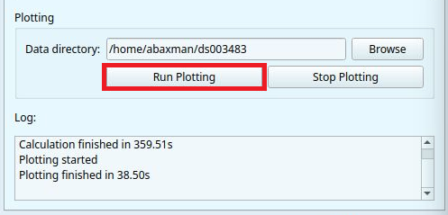
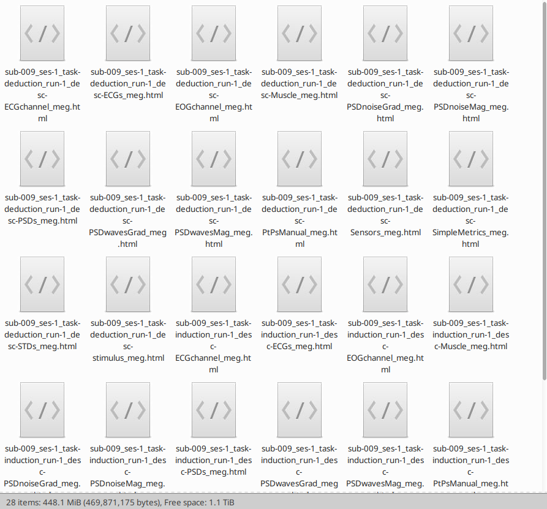

# GUI: Plotting Module

After completing the analysis with the calculation module, the next step is to generate the `html reports`. Thanks to the GUI, you can run the plotting module without coding.

## Set Data directory
You can *paste* the path to your **dataset** folder or click `Browse` to select the folder manually. MEGqc will search for the `derivatives` folder within your dataset and use the machine-readable outputs created by the calculation module. Then you just need to click on `Run Plotting`.



```{warning}

If you give a path to a different folder, such as the `subject` folder or the `calculation folder`, you will see in the Log window "Plotting error: Process exited with code 1". It will also create an empty folder called `derivatives` within your given paths.

**Your path only needs to lead to the dataset, you don't need to go any deeper within the structure.**

```

As with the Calculation Module, you can choose how many parallel jobs to use during the creation of the reports. The default option is `1`, but you can increase the speed of the processing by increasing the number of parallel Jobs.

```{dropdown} How do I know the right amount of parallel Jobs?

  * MEGqc automatically detects and displays the number of cores ('CPUs') and the total available RAM (see the lower-corner of the GUI).
  * The `Info` button will give you personalized recommendations based on system memory.
  * You may also use `-1` to use **all available cores**. 

``` 

## Congratulations!
You're done'! You will find the `html reports` in a folder called `reports` within the `derivatives` folder. The reports will be divided in `subjects` folder. If you've been following this tutorial, your path to your reports might look like this:


    /path/to/your/dataset/ds003483/derivatives/Meg_QC/reports/sub-009/


Now you can open these [reports](../book/metrics) in Chrome or Firefox to explore the interactive plots and visualize of the quality control analysis of your dataset!




```{admonition} How many reports will be created?
:class: tip

MEGqc will create 1 report for every derivatives it founds within the `calculation` folder. This means, a different report for every metric, of every run, task, session, subject and sensor you have analyzed with the Calculation Module. Be aware of this before you run the plotting module!

``` 


