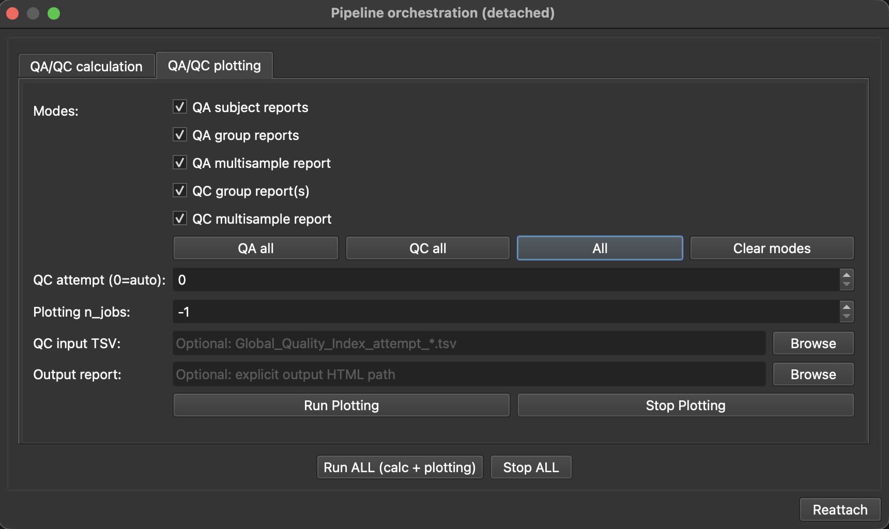

# Plotting Module (GUI)

Plotting reads existing derivatives and creates HTML reports.

## Step 1: Select datasets and profile mode

In **Inputs**:

- add one or more datasets,
- select profile mode (`legacy/new/reuse/latest`),
- optionally load/refresh profile IDs.

## Step 2: Select plotting scopes

In **QA/QC plotting** tab, enable one or more:

- `QA Subject`
- `QA Group`
- `QA Multisample` (requires >=2 datasets)
- `QC Group`
- `QC Multisample` (requires >=2 datasets)

## Step 3: Optional controls

- `QC attempt (0=auto)`
- `Plotting n_jobs`
- `QC input TSV` (single-dataset QC Group)
- `Output report` (single-report modes)

## Step 4: Run

Click **Run Plotting**. Use **Stop Plotting** to abort.

## Example GUI scenarios

### Scenario A: Subject + Group QA for one dataset

- Add one dataset.
- Enable `QA Subject` and `QA Group`.
- Click **Run Plotting**.

### Scenario B: QA multisample for two datasets

- Add dataset A and B.
- Enable `QA Multisample`.
- Click **Run Plotting**.

### Scenario C: QC group with specific attempt

- Add one dataset.
- Enable `QC Group`.
- Set attempt value.
- Click **Run Plotting**.
